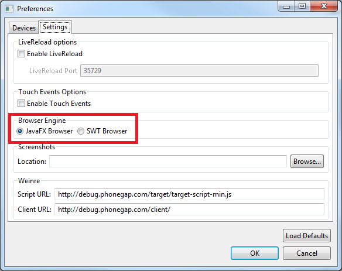
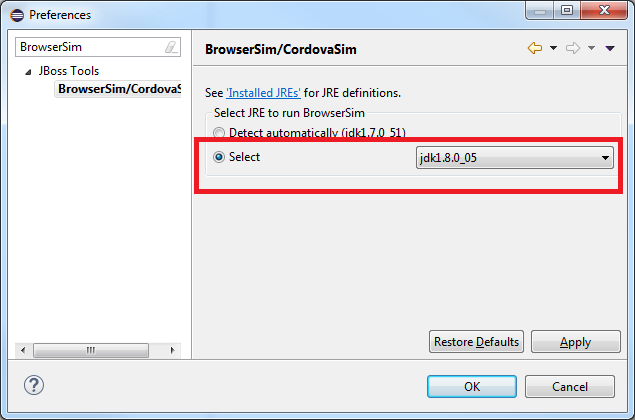
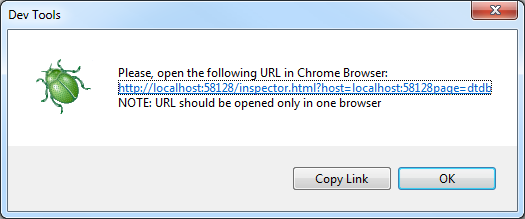
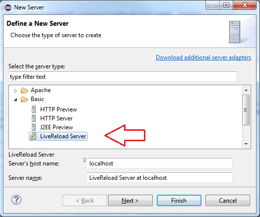
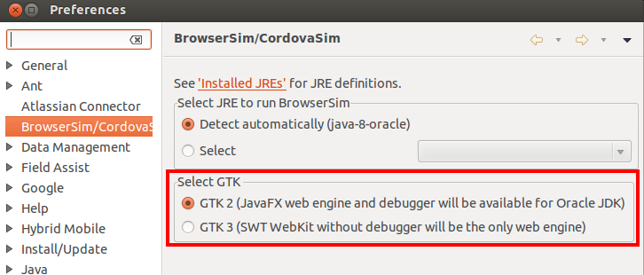

= BrowserSim FAQ
:page-layout: faq
:page-tab: docs
:page-status: green

== General BrowserSim

[qanda]
What is BrowserSim?::
  BrowserSim is a browser simulator which primarily is intended for having a quick, easy and multi-platform way of testing if your webapp will render and behave correctly on a mobile device.

Can I use BrowserSim as a replacement for testing on a real phone or emulator?::
   BrowserSim makes it easy to test basic layout questions / issues on any platform without having to install a platform specific emulator or manually using a phone. That said it is *not* 100% reliable since there are so many different brands / versions of phones there will be differences in behavior, thus no, BrowserSim does *not* replace real or emulated phone testing. For full verfication and testing you should test on a real phone.

How does BrowserSim work?::
  It wraps a WebKit browser (http://help.eclipse.org/indigo/index.jsp?topic=%2Forg.eclipse.platform.doc.isv%2Freference%2Fapi%2Forg%2Feclipse%2Fswt%2Fbrowser%2FBrowser.html[SWT WebKit] and http://docs.oracle.com/javafx/2/api/javafx/scene/web/WebView.html[JavaFX WebView]) and makes it respond and work like a mobile browser by spoofing content and media request headers.

So, BrowserSim has two web engines, doesn't it?::
  Yes. In the original there was only one web engine - http://help.eclipse.org/indigo/index.jsp?topic=%2Forg.eclipse.platform.doc.isv%2Freference%2Fapi%2Forg%2Feclipse%2Fswt%2Fbrowser%2FBrowser.html[SWT WebKit]. Unfortunately it has several drawbacks. For example, using SWT WebKit on Windows requires users to install http://support.apple.com/kb/DL1531[Apple Safari] (provides SWT WebKit engine), which is pretty obsolete for now - *May 9, 2012* was the last update. Additional SWT WebKit doesn't support Debugger API. Due to these limitations it was decided to add http://docs.oracle.com/javafx/2/api/javafx/scene/web/WebView.html[JavaFX] web engine support. Web engine can be switched via BrowserSim's preferences in the `Settings` tab:
+

What do I need to run BrowserSim?::
  If you want to use JavaFX web engine all you need is to run BrowserSim against http://www.oracle.com/technetwork/java/javase/downloads/index.html[Oracle JDK] version 7 or higher (version 8 is recommended). JDK can be specified via *Window* -> *Preferences* -> *JBoss Tools* -> *BrowserSim/CordovaSim*:
+ 

+
For SWT WebKit web engine the requirements for different platforms are as listed below:

Windows:::
* http://support.apple.com/kb/DL1531[Apple Safari] must be installed (it provides WebKit engine for BrowserSim).
Linux:::
* `WebKitGTK 1.2.0` or newer must be installed and available in the library load path. To do it use your package manager: +
Fedora, Red Hat Enterprise Linux (RHEL) - `yum install libwebkitgtk-1.0.so.0` +
Ubuntu - `apt-get install libwebkitgtk-1.0-0`
Mac OS X:::
* Available out-of-the-box.

How to add BrowserSim to the toolbar?::
   Go to *Window* -> *Customize Perspective* and select `BrowserSim` under `Command Groups Availability`. Then it becomes available in the global toolbar via the "phone" icon:
+

== Main Features

[qanda]
Can I debug with BrowserSim?::
  Yes, you can but only with JavaFX web engine which supports Debugger API (https://www.google.com/intl/en/chrome/browser/[Chrome] browser is a requirement). *Right-click on the BrowserSim* -> *Debug* -> *Dev Tools*. The following pop-up will be shown:
+

+
Open URL in Chrome and start to debugging.

+
WARNING: URL for debugging must be opened only in one browser. If you open in a second browser the browser will just stay empty. 

+
SWT WebKit can't handle Debugger API. However there is a *FireBug Lite* menu item instead of *Dev Tools* for that web engine. Using FireBug Lite you can preview HTML, CSS, DOM and scripts.

How to enable LiveReload for BrowserSim?::
  Both SWT WebKit and JavaFX web engines support http://tools.jboss.org/features/livereload.html[LiveReload]. First of all you should add the LiveReload Server and start it:

* Open `Servers` view (*Window* -> *Show View* -> *Servers*).   
* Add the LiveReload server, which is available in the `Basic` category:
+

+
After that *Right-click on the BrowserSim* -> *Enable LiveReload*. That's it - LiveReload is enabled!

+
WARNING: If you want to use http://tools.jboss.org/features/livereload.html[LiveReload] with JavaFX web engine you must run BrowserSim against Oracle JDK 8. JavaFX browser which is shipped with JDK 7 has no http://www.websocket.org/[WebSocket] support, which is vital for http://tools.jboss.org/features/livereload.html[LiveReload] functionality. Fortunately it is fixed in JDK 8.

== Platform Specific Questions

[qanda]
Is it possible to run BrowerSim against GTK 3 on Linux?::
  By default BrowserSim is launched against http://www.gtk.org/[GTK] 2. However, there is a Linux specific option to enable GTK 3 for the process launched by BrowserSim / Cordovasim but JavaFX web engine will be unavailabe. Basically JavaFX uses GTK 2 libraries and is unlikely to switch in the near future. Here is the related https://javafx-jira.kenai.com/browse/RT-35264[jira issue].
+

+
NOTE: In order to run BrowserSim against GTK 3 `libwebkitgtk-3.0` must be installed. + 
Fedora, RHEL - `yum install libwebkitgtk-3.0.so.0` +
+
I'm not able to find libwebkitgtk-1.0.so.0 on RHEL 7. What should I do?::
Since there is no webkitgtk package for RHEL 7, you cannot launch BrowserSim with SWT.Webkit engine under GTK2. You can launch BrowserSim under GTK2 only with JavaFX(requires Oracle JDK).
+
I'm not able to find libwebkitgtk-3.0.so.0 on RHEL 6. What should I do?::
Since there is no webkitgtk3 package for RHEL 6, you cannot launch BrowserSim with SWT.Webkit engine under GTK3. You can launch BrowserSim only under GTK2 in RHEL 6.
+
I have Oracle JDK installed on Linux, but I cannot set JavaFX as web engine. What should I do?::
If you install Oracle JDK via package manager (using i.e. `yum install java-1.7.0-oracle-1.7.0`) you might need to also install JavaFX package. The instructions might vary for your distribution, but on RHEL it can be installed using command like `yum install java-1.7.0-oracle-javafx`. 