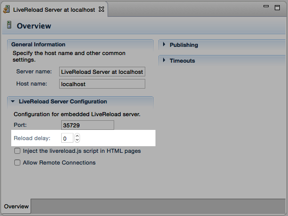

= Frequently Asked Questions
:page-layout: faq
:page-tab: docs
:page-status: green

== General

[qanda]
What is JBoss Tools?::
  JBoss Tools is a set of plugins for Eclipse that complements, enhances and goes beyond the support that exists for JBoss and related technologies in the default Eclipse distribution.

How do I install JBoss Tools?::

Go to link:../../downloads[Downloads] to select the distribution that fits your needs.
+
Here you can:

  * Choose an all-in-one install via link:https://www.jboss.org/products/devstudio[Red Hat CodeReady Studio], or
  * Choose individual features from the link:/downloads/[JBoss Tools] update site, or
  * Install from the link:http://marketplace.eclipse.org/[Eclipse Marketplace].

What is JBoss Tools Integration Stack?::
  JBoss Tools integration stack is a set of Eclipse plugins that add support for JBoss SOA and Business rules related frameworks, such as Drools, jbpm, SwitchYard, Fuse, etc.

How do I install JBoss Tools Integration Stack?::
  The recommended approach is to use link:/features/central.html[JBoss Central] to select the features from the Integration Stack you would like to use. JBoss Central is included in both JBoss Tools and JBoss Developer Studio for your convenience.

Is JBoss Tools open source?::
   Yes! Please feel free to link:/getinvolved[get involved]!

=== JBoss Tools Features

[qanda]
Which operating systems, runtimes and frameworks does JBoss Tools support?::
  In general JBoss Tools attempts to ensure you can continue to use both old and new runtimes &amp; frameworks with its releases but we do not add new features to old streams. Support for the latest &amp; greatest runtimes will only be available in the latest releases. This link:https://community.jboss.org/wiki/MatrixOfSupportedPlatformsRuntimesAndTechnologiesInJBossToolsJBDS[Matrix] gives an overivew of the various supported frameworks, runtimes, operating systems, platforms, and JDK versions.

Where can I find answers about the Browser Simulator?::
  See the link:./browsersim.html[Browser Simulator FAQ]

Where can I find answers about the CordovaSim?::
  See the link:./cordovasim.html[CordovaSim FAQ]

Where can I find answers about the Visual Page Editor?::
  See the link:./visualeditor.html[Visual Page Editor FAQ]

=== Server/Publishing

[qanda]
I use eclipse with the jboss tools installed, is there any way to republish my app that doesnt involve what feels like 50 clicks by opening server tab, expanding server, right clicking the module and selecting full publish?::

Use menu:Help[Key assist] and a yellow window pops up with current keyboard shortcuts. Type "Full" and a "Full Publish module" should show up with the right key.
It is a bit long, but you can reconfigure it if you wish to under menu:Preferences[General, Keys].

=== LiveReload

[qanda]
I use JBoss Tools with LiveReload enabled, but my HTML Page did not refresh as expected after I published a change on the application server.::

The LiveReload tooling is notified by the Server tooling when a resource was published on the application server. But there may be a slight delay before the application server actually handles the resource change.
In the mean time, the user may still access the old resource in a response to an HTTP request.

To circumvent this problem, the LiveReload server configuration editor provides a "Reload delay" property that can be adjusted to give enough time
to the application server to detect and take into account the changes before the web browser sends its HTTP request. The default value is 500ms.

