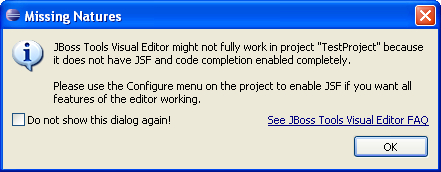
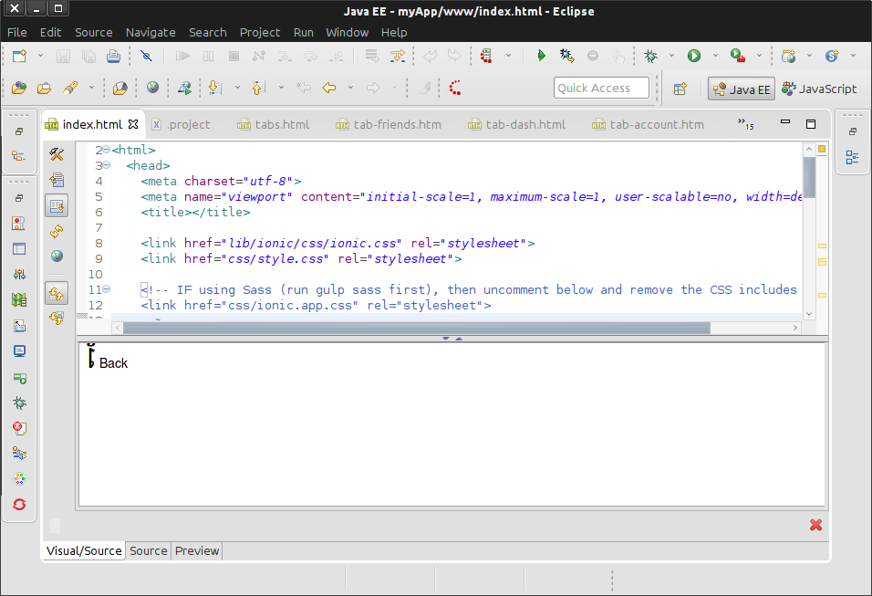

= Visual Page Editor FAQ
:page-layout: faq
:page-tab: docs
:page-status: green

== General Visual Editor

[qanda]
What is Visual Editor?::
	Visual Editor is tool for previewing HTML files and previewing/editing JSP/JSF files.

Which platforms are supported by Visual Editor?::
	Previewing HTML files is supported on every platform. On Windows and Mac OS everything works OOTB, on Linux WebKitGTK required.
	To install it execute the following command:
	* For GTK2
	** Fedora, RHEL - `yum install webkitgtk`
	** Ubuntu - `apt-get install libwebkitgtk-1.0-0`
	* For GTK3
	** Fedora, RHEL - `yum install webkitgtk3`
	** Ubuntu - `apt-get install libwebkitgtk-3.0-0`
	

+
List of supported platforms (and their IDs) for previewing/editing JSP/JSF files:

  * Windows with Java 32-bit (win32.win32.x86)
  * Windows with Java 64-bit (win32.win32.x86_64) - Experimental support is available in JBoss Tools 4.1.0.Beta1/JBoss Developer Studio 7.0.0.Beta1 and above.
  ** To enable it, you need to install XULRunner from this update site: http://download.jboss.org/jbosstools/updates/integration/luna/core/xulrunner/xulrunner-1.9.2_win64-2014-08-22_09-55-58-B4/
  ** If you cannot start Eclipse after this installation, you may use `-Dorg.jboss.tools.vpe.loadxulrunner=false` option as described in the next question. Please comment in  https://issues.jboss.org/browse/JBIDE-2720[JBIDE-2720] if something went wrong.
  	* Linux x86 (gtk.linux.x86) GTK2 only
  	* Linux x86-64 (gtk.linux.x86_64) GTK2 only
  	* Mac OS X Cocoa with Java 32-bit (cocoa.macosx.x86)
  	* Mac OS X Carbon with Java 32-bit (carbon.macosx.x86) [not supported by JBoss Tools 3.3.0 and later, JBDS 5.0 and later]

  Eclipse crashes when I use Visual Editor, what can I do?::

  	This may happen  in JBoss Tools 3.3.0.M2 and above with Eclipse 3.7.0 due to the https://issues.jboss.org/browse/JBIDE-9144[WebKit and XULRunner conflict]. You can disable Visual Editor by adding the option `-Dorg.jboss.tools.vpe.loadxulrunner=false` to the eclipse.ini (or jbdevstudio.ini if you use JBoss Developer Studio).

  Visual Editor doesn't start at any platform and shows message 'The VPE editor can't be run because your system environment needs to be changed slightly'::
  	Check if you version of JBoss Developer Studio/JBoss Tools is compatible with you version of Eclipse, see the http://www.jboss.org/community/wiki/MatrixofsupportedplatformsruntimesandtechnologiesinJBossToolsJBDS[compatibility matrix].

  Visual Editor starts OK, but the following message dialog appears::
+  	

Some functionality of Visual Editor may not work if a project doesn't have `org.jboss.tools.jsf.jsfnature` or `org.jboss.tools.jst.web.kb.kbnature` in .project configuration. To fix this problem and turn off the message box execute next steps:
  	* Right mouse button click on a project in Package Explorer.
  	* Select Configure -> Add JSF Capabilities from the context menu.
  	* Configure your project using Add JSF Capabilities wizard and press Finish.	

+
*P.S.* If you are sure that your project does not need JSF capabilities, just disable this message box by checking "Do not show this dialog again!" checkbox.

Visual Part doesn't start and *"XPCOM error -2147467259"* is shown::
  	Something bad happened with buildin xulrunner. To check it you should:
      * Go to Eclipse -> Help -> About -> Installation Details... ->  Configuration
      * find org.eclipse.swt.browser.XULRunnerPath and open this path in terminal
      * try xulrunner.exe -version or ./xulrunner -version and it should show what is needed for XR to work

After choosing HTML5 Visual Editor mode on Linux, Eclipse crashes unexpectedly. What can I do about it?::
	The reason of Eclipse crash may be connected with SWT.WebKit conflicts with http://bluejeans.com/[BlueJeans] or http://www.google.com/hangouts/[Google Talk] browser plugins. We recommend to update Google Talk plugin to the latest version, it can help to avoid crashes. Uninstalling these plugin will also fix Eclipse crashing.
	Related issues: 
		* https://bugs.eclipse.org/bugs/show_bug.cgi?id=334466[Google Talk issue in Eclipse bugzilla]
		* https://bugs.eclipse.org/bugs/show_bug.cgi?id=433606[BlueJeans issue in Eclipse bugzilla]
		* https://bugzilla.redhat.com/show_bug.cgi?id=1160411[BlueJeans issue in RedHat bugzilla]

After choosing HTML5 Visual Editor mode on Linux, Eclipse freezes during restart. What can I do about it?::
	This may happen because SWT.WebKit conflicts with http://bluejeans.com/[BlueJeans] plugin for Firefox. This issue is already fixed, so we recommend to update bluejeans to latest version. See related issues in  https://bugs.eclipse.org/bugs/show_bug.cgi?id=433606[eclipse bugzilla] and https://bugzilla.redhat.com/show_bug.cgi?id=1160411[RedHat bugzilla].
	
== Platform Specific Questions

[qanda]
  I open HTML file on Linux and see incorrect preview ::
  	That happens because xulrunner we use does not support HTML5 features. We have to use xulrunner for previewing HTML files due to the https://issues.jboss.org/browse/JBIDE-9144[WebKit and XULRunner conflict].
	
+
To have correct HTML preview you should start Eclipse or JBoss Developer Studio with `-Dorg.jboss.tools.vpe.loadxulrunner=false` option in eclipse.ini or jbdevstudio.ini).