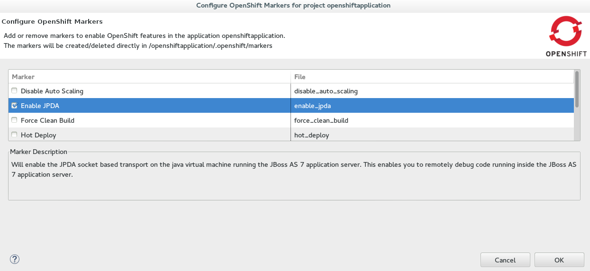
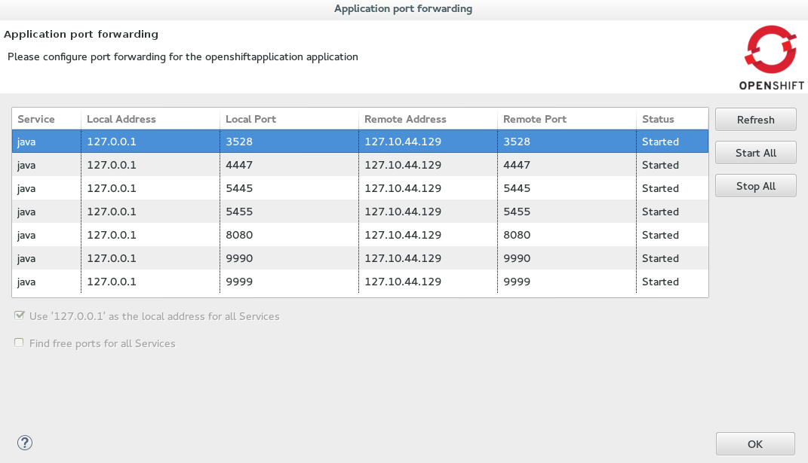
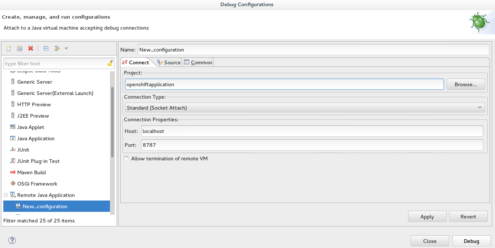

= Debug an OpenShift Online Application
 
OpenShift Tools enables you to debug your deployed OpenShift Online applications within the IDE, enabling you to take advantage of the IDE debugging tools. A number of configuration tasks are required both locally and remotely  to enable the IDE debugger to connect to the OpenShift server and OpenShift Tools for achieving this. Some tasks only need to be completed once for each OpenShift Online application but others must be completed every time you reconnect to OpenShift Online from the IDE. Instructions are provided for the following tasks:

. <<configurefordebugging,Configure the OpenShift Server for Debugging>>
. <<enableportforwarding,Enable Port Forwarding for the Local and Remote Debug Ports>>
. <<idedebugger,Configure and Connect the IDE Debugger>>

This article guides you through each of these configuration requirements and must be completed in the order given.

[NOTE] 
Your application must be deployed on OpenShift before attempting to configure the OpenShift server for debugging and enabling port forwarding.

[[configurefordebugging]]
== 1. Configure the OpenShift Server for Debugging             
You must first configure the OpenShift server, to which your application is deployed, for debugging. This requires setting the `Enable JPDA` (Java Platform Debugger Architecture) marker in your application source code and republishing the application. Marker information is retained with the application so you only need to complete this task once for each OpenShift Online Application:

To configure the OpenShift server for debugging, complete the following steps:

. In the `Project Explorer` view, right-click the project and click `OpenShift` &rarr; `Configure Markers`.                     
. In the `Configure OpenShift Markers` window, select the `Enable JPDA` check box and click `OK`.
+
.OpenShift Enable JPDA Marker Selected
 
+               
. In the `Servers` view, right-click the server adapter for the application and click `Publish`. 
. In the `Publish Changes` window, in the `Commit message` field type a message for the commit.
. From the `Files` list, ensure the `.openshift/markers/enable_jpda` check box is selected and click `Commit and Publish`.

The project changes are pushed to the remote Git repository and the application is automatically updated on the OpenShift server. 

[NOTE]
When debugging is enabled on the OpenShift server a debug port is assigned. To perform the remaining tasks, it is important to know which port is the debug port. To identify the debug port, see the cartridge documentation.

[[enableportforwarding]]
== 2. Enable Port Forwarding for the Local and Remote Debug Ports
After the OpenShift server is configured for debugging, you must enable port forwarding for the local (IDE) and remote (OpenShift server) debug ports. You can achieve this with the OpenShift Tools `Application port forwarding` wizard, which connects all local ports to their remote counterpart ports, including the local and remote debug ports.

Port forwarding is automatically stopped when your OpenShift Online connection closes; this includes when you close the IDE or change workspaces. You must enable port forwarding every time you reconnect to OpenShift Online from the IDE.

To enable port forwarding, complete the following steps:

. In the `OpenShift Explorer` view, right-click the application and click `Port Forwarding`. 
. In the `Application port forwarding` window, click `Start All`. Ensure the `Status` value shows `Started` for the debug ports and click `OK` to close the `Application port forwarding` window. 
+
.Port Forwarding Started for All Ports
    

[[idedebugger]]
== 3. Configure and Connect the IDE Debugger
With port forwarding configured for the debug ports, you must create a debug configuration for the OpenShift server and connect the IDE debugger. You can then review debug output in the `Debug` and `Console` views. The debug configuration is retained with the workspace so you only need to create a new debug configuration once for each OpenShift Online Application. But you must restart each debug configuration every time you reconnect to OpenShift Online from the IDE.

To configure and connect the IDE Debugger, complete the following steps:

. In the global toolbar of the JBoss perspective, click the drop-down list for the `Debug` icon and select `Debug Configurations`.                     
. From the debug configurations list, select `Remote Java Application` and click the `New launch configuration` icon .
. In the `Connect` tab, complete the following fields:
** In the `Project` field, type the name of the workspace project associated with the OpenShift application or click `Browse` to locate the project.
** In the `Port` field, type the value of the debug port.     
** Click `Apply` and then click `Debug`. 
+
.Debug Configuration Ready for Your OpenShift Application 

Connecting to the OpenShift server may take some time to complete and you can monitor the progress in the `Progress` bar or `Progress` view. 

== Did You Know?
* Setting the Enable JPDA marker adds an `.openshift/markers/enable_jpda` file to your project. To locate the hidden `.openshift` directory and access the file, open the `Navigator` view.
* You can also access the `Port Forwarding` wizard by right-clicking the server adapter of the application in the `Servers` view, and then clicking `OpenShift`&rarr;`Port forwarding`.
* The `Debug` perspective automatically arranges useful views for debugging. To open the `Debug` perspective, click `Window` &rarr; `Open Perspective` &rarr; `Debug`.
* You can set the debugger to look up source code for classes it encounters that are not contained in your project, for example classes used by application servers defined in the IDE. When inputing values for the launch configuration, in the `Source` tab click `Add`. From the list of source containers, select `JBoss Maven Source Container` and click `OK`. The JBoss Maven Source Container uses indexes available from Maven repositories to locate the source code. From the list, select a runtime server, the libraries of which will be indexed in the JBoss Maven Source Container, and click `OK`.
