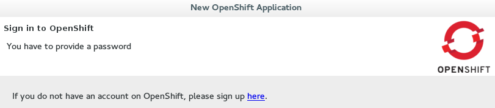
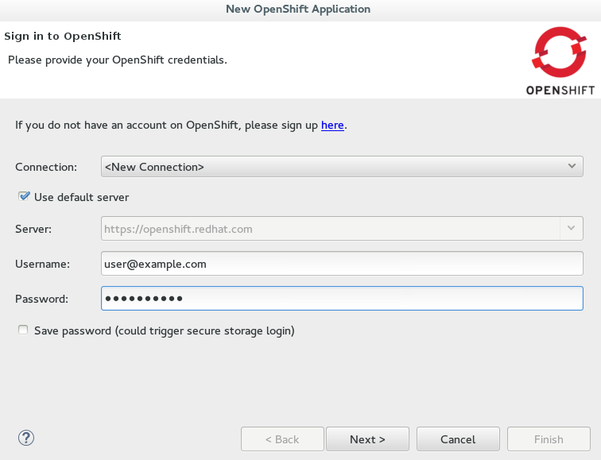
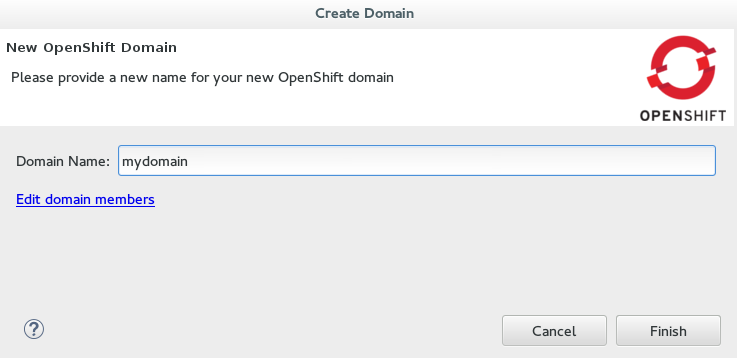
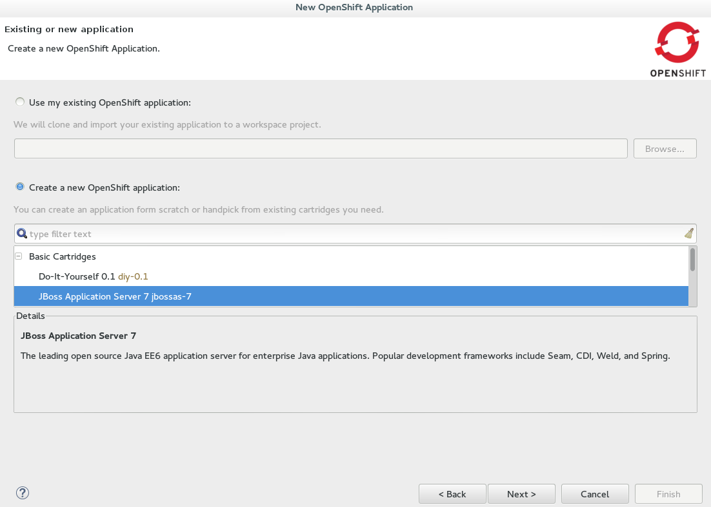
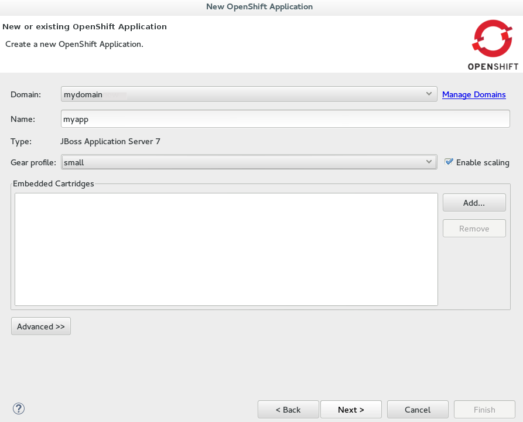
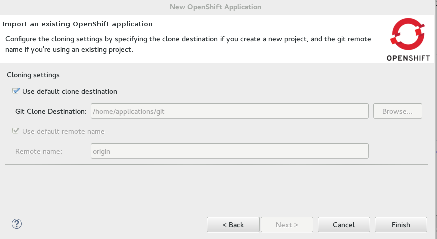
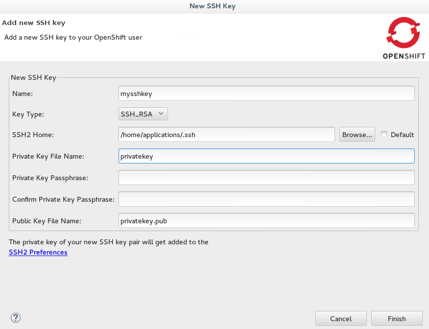

= Create and Deploy your First OpenShift Online Application with OpenShift Tools

OpenShift Tools provides an all-in-one `New OpenShift Application` wizard for creating new OpenShift applications from templates and existing projects. This wizard is the starting point for creating all new OpenShift Online applications from the IDE and also for importing OpenShift Online applications to your workspace.

The `New OpenShift Application` wizard is an ideal starting point for new users to OpenShift and OpenShift Tools as it guides you through all the steps necessary to set up the IDE to use your OpenShift Online account and configure your account ready for applications.

The instructions here demonstrate how to use this wizard and a default OpenShift application template to create a basic OpenShift Online application. This includes one-time steps (marked with N), such as signing up for an OpenShift Online account, creating an OpenShift Online domain and uploading SSH keys. If you have previously used OpenShift Online and OpenShift Tools, you can omit these one-time steps as appropriate.     

== Start the New OpenShift Application Wizard
. In `JBoss Central`, under `Start from scratch`, click `OpenShift Application`.

== (N) Sign up for an OpenShift Online Account
[start=2]
. If you do not have an OpenShift Online account, click the link provided to sign up for an OpenShift account and follow the instructions on the OpenShift website.
+
.Link to Sign up for a New OpenShift Online User Account

+
. When you have completed the sign-up process, restart the `OpenShift Application` wizard from JBoss Central.

== Connect to OpenShift Online
[start=4]
. Complete the fields about your OpenShift Online account as follows:
** From the `Connection` list, select `New Connection`.                
** Ensure the disabled `Server` field states `https://openshift.redhat.com`.        
** In the `Username` and `Password` fields, type your account credentials.         
+
.Connection Information Provided for OpenShift Online Account

+
. Click `Next`.

== (N) Create a Domain
[start=6]
. In the `Domain Name` field, type an alphanumeric name for your new OpenShift Online domain and click `Finish`. The provided domain name must be unique across all domains on OpenShift Online; if it is not unique, you are directed back to the `Create Domain` window to provide a unique domain name. 
+
.New OpenShift Domain Name Provided

== Provide Essential New Application Details
[start=7]
. Complete the fields about the type of OpenShift application you want to create as follows: 
** Click `Create a new OpenShift application`.
** Expand `Basic Cartridges` and select `JBoss Application Server 7`.
+
.Basic Cartridge Selected for the New OpenShift Online Application

+
. Click `Next`.
. Complete the fields about your OpenShift application as follows:
** Ensure the `Domain` field displays the OpenShift Online domain with which you want to host your application.
** In the `Name` field, type an alphanumeric name for your application.
** From the `Gear profile` list, select `small`.
** Select the `Enable scaling` check box.
+
.New OpenShift Application Information Provided

+
. Click `Next`.

== Configure the Corresponding Workspace Project for the New Application
[start=11]
. Complete the fields about the corresponding workspace project as follows:
** Ensure the `Create a new project` check box is selected.
** Ensure the `Create and set up a server for easy publishing` check box is selected. This automatically creates an OpenShift server adapter for the application, enabling you to easily publish project changes to the OpenShift server. 
. Click `Next`.
. Ensure the location in the `Git Clone Destination` field exists and corresponds to where you want to make a local git repository for the project source code.
+
.Valid Git Clone Destination Specified

== (N) Enable Communication between the IDE and OpenShift
[start=14]
. Click `SSH Keys` wizard.             
. Click `New`.
. Complete the fields about the SSH Keys to be created as follows:             
** In the `Name` field, type a name for the SSH key pair.
** From the `Key Type` list, ensure `SSH_RSA` is selected. 
** In the `SSH2 Home` field, ensure your .ssh directory path is correct.         
** In the `Private Key File Name` field, type a name for the private key file name. The `Public Key File Name` field populates automatically with the name of the private key file name with .pub appended.
+
.New SSH Key Information for OpenShift Online Provided

+
. Click `Finish`.             
. Click `OK` to close the `Manage SSH Keys` window.

== Create the OpenShift Online Application
[start=19]
. Click `Finish` for the wizard to start generating the new OpenShift application. This process may take some time to complete.
. If you are prompted that the authenticity of the host cannot be established and asked whether you want to continue connecting, ensure that the host name matches that of your application and domain and click `Yes`.

== Some OpenShift Terminology
* Gear: A server container with a set of resources that allow you to run your application
* Cartridge: Plug-ins that house the framework or components that can be used to create and run your application
** Standalone cartridge: Languages and application servers that serve your application
** Embedded cartridge: Functionality to enhance your application
* Scaling: Enables your application to react to changes in traffic and automatically allocate the necessary resources to handle the current demand

== Did You Know
* You can also start the `New OpenShift Application` wizard from the `OpenShift Explorer` view by right-clicking a connection, domain or existing application and clicking `New` &rarr; `Application`.
* To save time when logging in to OpenShift Online in future, you can click the `Save Password` check box in the `Sign in to OpenShift` window. The password is retained in secure storage provided by the IDE and automatically populates the `Password` field for the associated connection.
* Using the `New OpenShift Application` wizard, you can also create a new OpenShift application from an existing workspace project or a Git source.
+
////
See <link to other article once it is made.>
////
+
* Each time you start the IDE or switch workspaces you need to reconnect the IDE to OpenShift Online. To do this, in the `OpenShift Explorer` view click the `Connection` icon .
