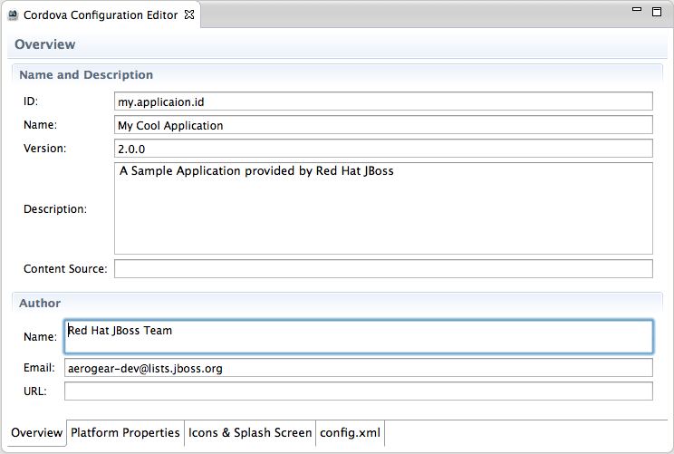

= Aerogear What's New in 1.0.0.Beta1
:page-layout: whatsnew
:page-component_id: aerogear
:page-component_version: 1.0.0.Beta1
:page-product_id: jbt_core
:page-product_version: 4.1.0.Beta1

== Hybrid Mobile (Cordova) Tools
New Hybrid Mobile Project wizard 	Creates a project structure that is compatible with the cordova-cli projects

image::images/1.0.0.Beta1/wizard.png[]

Wizard will pre-populate your config.xml.

related_jira::JBIDE-13650[]

== Cordova Configuration Editor

Provides easier editing for Cordova's flavour of w3c widget specification XML configuration

related_jira::JBIDE-13646[]

== Run support for Android and iOS

Creates, compiles and runs the native application on the native platform emulators and devices.

image::images/1.0.0.Beta1/runConfigs.png[]

* Run on iOS emulator. Creates and compiles a XCode project and runs the resulting artifacts on the iOS simulator.
* Run on Android emulator Creates and compiles an Android project and runs it on the Android emulator.
* Run on Android device Runs the project on an Android device if there is one attached

related_jira::JBIDE-13645,JBIDE-13648[]
