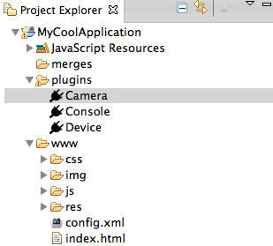

= Aerogear What's New in 1.0.100.Beta1
:page-layout: whatsnew
:page-component_id: aerogear
:page-component_version: 1.0.100.Beta1
:page-product_id: jbt_core
:page-product_version: 4.1.1.Beta1

== Hybrid Mobile (Cordova) Tools
=== Export Native Platform Project Wizard 	

Exports Hybrid Mobile projects as XCode or Android projects.

image::./images/1.0.100.Beta1/ExportWizard.png[]

related_jira::JBIDE-13651[]

=== Export Mobile Application Wizard 	

Sister wizard to the Export Native Platform Project Wizard. Export Mobile Application Wizard creates compiled binary for running on the targeted platform(s).

related_jira::JBIDE-15197[]

=== Cordova Plug-in Discovery Wizard 	

Discover and install Cordova Plug-ins from a registry to your Hybrid Mobile projects. Wizard also enables installation of plug-ins via a Git repository or from a directory.

related_jira::JBIDE-13647[]

=== Project Explorer extensions for Cordova Plug-ins 	

Extends the Project Explorer so that installed Cordova Plug-ins are visible, enables easy installation and removal of Cordova Plugins. Also enables the properties view for installed Cordova Plug-ins.

