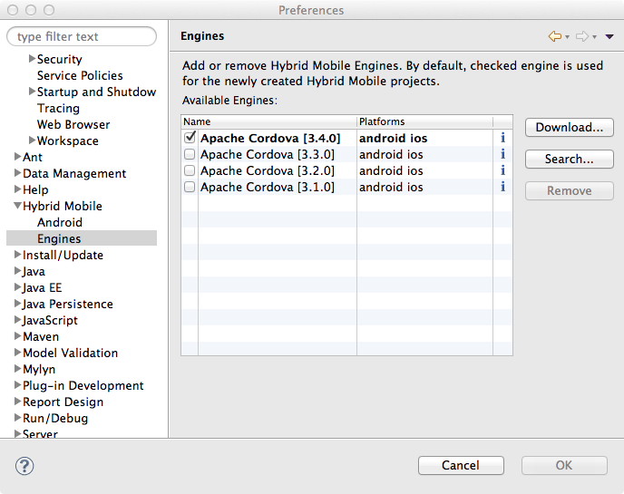
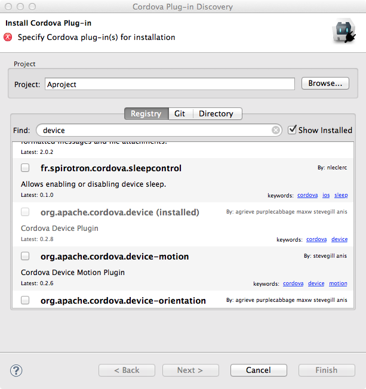

= Aerogear What's New in 1.1.0.Beta1
:page-layout: whatsnew
:page-component_id: aerogear
:page-component_version: 1.1.0.Beta1
:page-product_id: jbt_core
:page-product_version: 4.2.0.Beta1

== Hybrid Mobile (Cordova) Tools
=== Search and use Cordova engines from local file system

Hybrid Mobile tools can search and use Cordova engines from local directories. This permits custom Cordova engines to be used together with the tools.
At this time only custom engines that adhere to the file and naming structure of Apache Cordova distributions will be recognized by the tools.

related_jira::JBIDE-16408[]

=== Preferences for default engine 

A preference is added for selecting a default engine. Default engines are used when a configured engine for a project is removed and on the new project wizard
to pre-select the engine. See above for a screen shot for the new preference node.

related_jira::JBIDE-16550[]

=== Plug-in registry is now cached

The registry information is now cached. This causes significantly less network calls when using Cordova Plug-in Discovery wizard. 

related_jira::JBIDE-16692[]

=== Support for XCode 5.1

XCode simulator integration has been updated to support XCode 5.1 version.

related_jira::JBIDE-16744[]

== Cordova Plug-in Discovery wizard has an option to show already installed plug-ins

There is a new "Show Installed" check box to show already installed Cordova plug-ins on a project.

related_jira::JBIDE-16257[]

