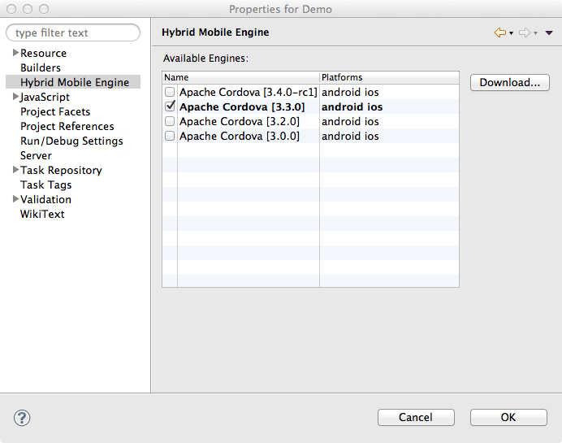

= Aerogear What's New in 1.1.0.Alpha2
:page-layout: whatsnew
:page-component_id: aerogear
:page-component_version: 1.1.0.Alpha2
:page-product_id: jbt_core
:page-product_version: 4.2.0.Alpha2

== Hybrid Mobile (Cordova) Tools
=== Multiple Hybrid Mobile Engine support 	

You can now download and select the Cordova engines and versions to use with your projects.

related_jira::JBIDE-14407[]

