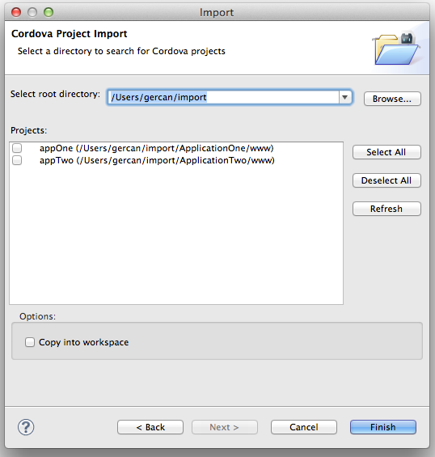
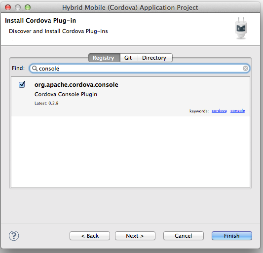
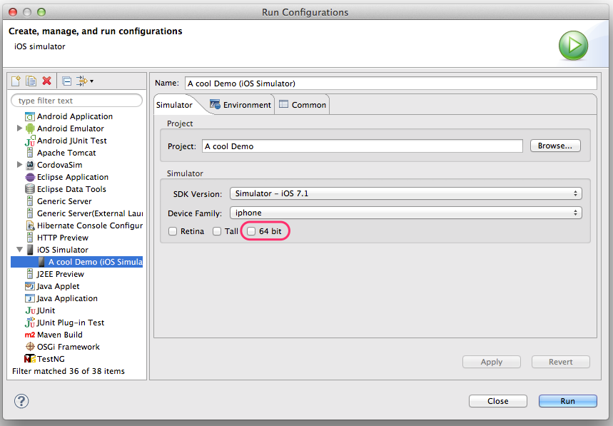

= Aerogear What's New in 1.1.0.Beta2
:page-layout: whatsnew
:page-component_id: aerogear
:page-component_version: 1.1.0.Beta2
:page-product_id: jbt_core
:page-product_version: 4.2.0.Beta2

== Hybrid Mobile (Cordova) Tools

=== Import Cordova projects 

It is now possible to import Cordova projects and start using them as Hybrid Mobile projects, with the new import wizard. 
This feature can import projects that are created by Cordova CLI

related_jira::JBIDE-13649[]

=== Add Cordova plug-ins when creating Hybrid Mobile Projects

The New Hybrid Mobile(Cordova) project wizard now provides plug-in selection pages. You can now select an initial set of 
Cordova plug-ins to be installed to a new Hybrid Mobile project. Starting with _org.apache.cordova.console_
is highly recommended.

related_jira::JBIDE-16728[]

=== 64 bit iOS simulators are now supported

You can select to run 64 bit iOS simulators.

related_jira::JBIDE-17099[]

