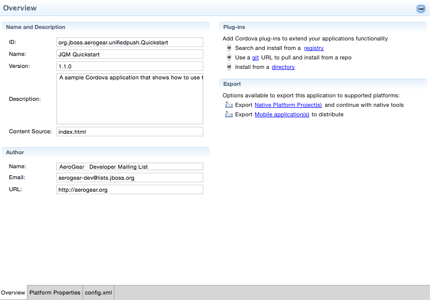
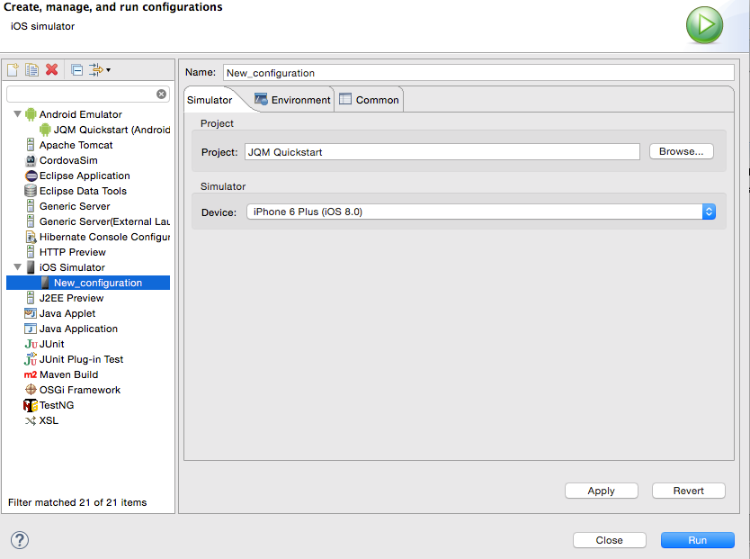

= Aerogear What's New in 1.1.0.Beta3
:page-layout: whatsnew
:page-component_id: aerogear
:page-component_version: 1.1.0.CR2
:page-product_id: jbt_core
:page-product_version: 4.2.0.CR2

== Hybrid Mobile (Cordova) Tools

=== Improved layout Cordova config.xml editor

Config.xml editor now provides quick access to actions common development actions.

=== Adjusted Run on Server support to XCode 6 

Run on Server uses the XCode 6 features and has a new simplified UI 

related_jira::JBIDE-18410[]

=== Restore for local and git plug-ins

In addition to plug-in registry, Cordova plugins that are installed from directories and git repositories can now be restored.

related_jira::JBIDE-18360[]

