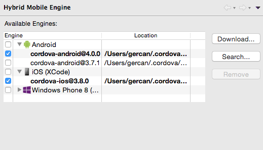
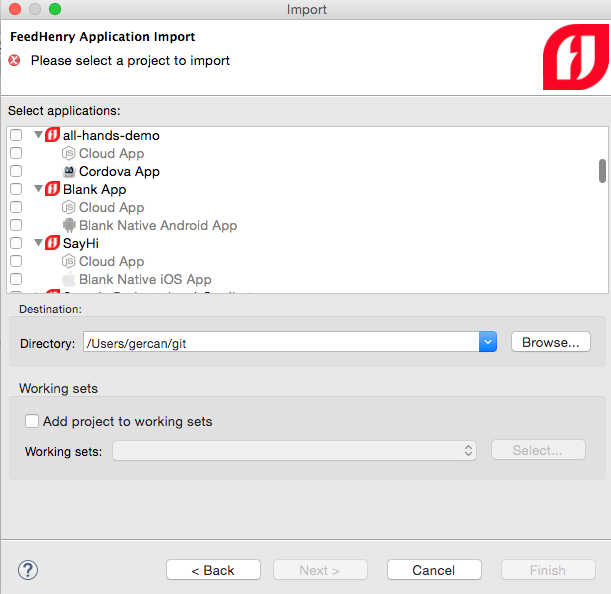

= What's New in Mobile for JBoss Tools 4.3.0 Alpha 2 
:page-layout: whatsnew
:page-component_id: aerogear
:page-component_version: 1.2.0.Alpha2
:page-product_id: jbt_core
:page-product_version: 4.3.0.Alpha2

== Independent Cordova platforms 

You can now select the Cordova version per platform. This allows you to mix and
match different Cordova version to best accommodate the requirements of your
application.

== FeedHenry Application import dialog refreshed

Uses improved iconography and better connection handling.

== Cordova platform downloads is using npm.

Cordova engine downloads have switched to use https://www.npmjs.com/[npm] to improve the reliability of
the downloads. Download dialog is also refreshed to adjust to this change. 

