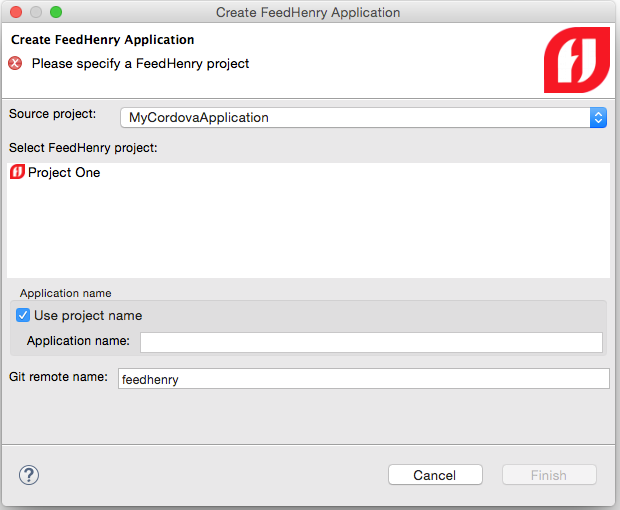

= What's New in Mobile for JBoss Tools 4.3.0 Beta 2
:page-layout: whatsnew
:page-component_id: aerogear
:page-component_version: 1.2.0.Beta2
:page-product_id: jbt_core
:page-product_version: 4.3.0.Beta2

== Create FeedHenry Cordova Application

A new wizard allows you to convert a hybrid mobile project to a FeedHenry
application. The wizard creates a client application on the FeedHenry cloud,
configures the git repository for the project.

