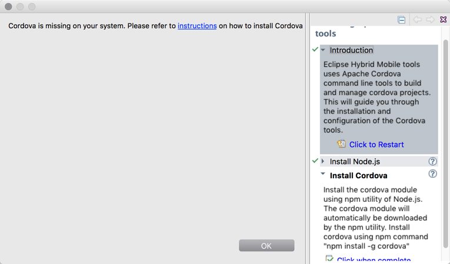

= What's New in Mobile for JBoss Tools 4.3.1 CR1
:page-layout: whatsnew
:page-component_id: aerogear
:page-component_version: 1.3.1.CR1
:page-product_id: jbt_core
:page-product_version: 4.3.1.CR1

== Cordova CLI based backend for Hybrid Mobile projects

Hybrid mobile tools now use Cordova CLI for Cordova plugin management and platform
builds. This allows us to provide accurate build and Cordova plugin management
that is compatible with the latest Apache Cordova releases.

This new feature uses Cordova CLI installed on your system and guides you
through installation if they are missing.

