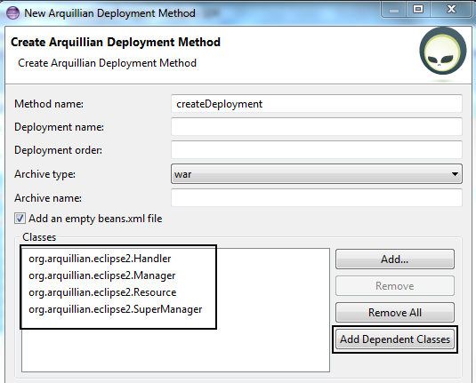
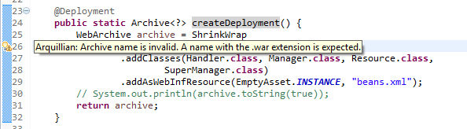
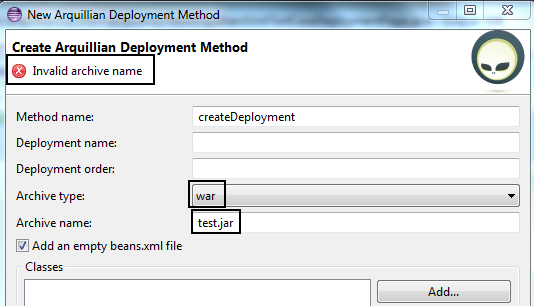
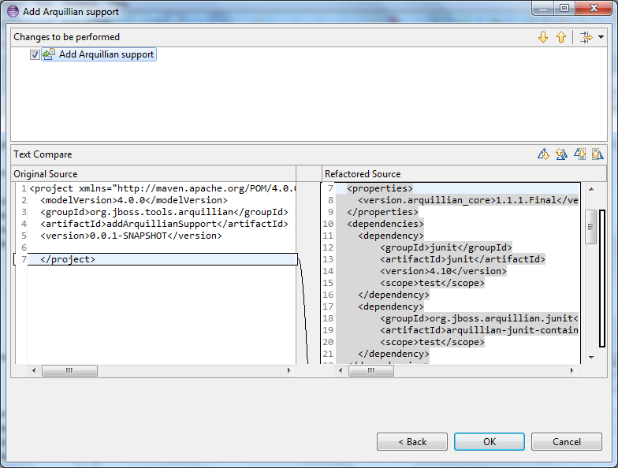
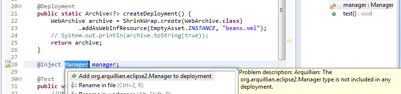
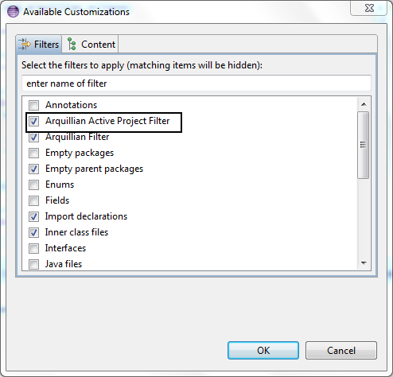

= Arquillian What's New in 4.2.0.Alpha2
:page-layout: whatsnew
:page-component_id: arquillian
:page-component_version: 4.2.0.Alpha2
:page-product_id: jbt_core 
:page-product_version: 4.2.0.Alpha2

== Arquillian Dependencies 	

The *Create Arquillian Deployment Method* action scans for all, direct and indirect dependencies.
Those dependencies can be automatically added to the deployment using the Create Arquillian Deployment Method wizard.

related_jira::JBIDE-14525,JBIDE-14518[]

== Refactor Arquillian validator 	

Now, the Arquillian validator uses AST to search for dependencies.
This way, performance are significantly improved because we don't have to create Arquillian archive(s) anymore.
Likewise, the Arquillian validator is implemented as an Eclipse builder instead of JDT compiler participant which improves its stability.

related_jira::JBIDE-16324,JBIDE-16331[]

== ShrinkWrap Archive name/type validation 	

The Arquillian validator checks if an archive name extension matches an archive type.

See http://screencast.com/t/1zGLUgYVLBY[screencast]

related_jira::JBIDE-14780,JBIDE-14781,JBIDE-15657[]

== Add Arquillian support 	

The *Add Arquillian Support* dialog is significantly improved.
A user can decide if he wants to change the pom.xml file, which sections to change as well as which arquillian version to use.
There is also the pom.xml preview page.

image::images/addArquillianSupport.png[]

related_jira::JBIDE-14426,JBIDE-14428[]

== Add _missing type_ to deployment Quick Fix 	

Arquillian includes a new Quick Fix.

related_jiras::JBIDE-14528[]

== Arquillia Cruiser View filtering 	

Arquillia Cruiser View contains a filter to filter active projects.

related_jira::JBIDE-14524[]

== Arquillia Cruiser View linking 	

Double-clicking an archive resource in the Arquillia Cruiser view opens the resource in the associatted Eclipse editor.

related_jira::JBIDE-14522[]

