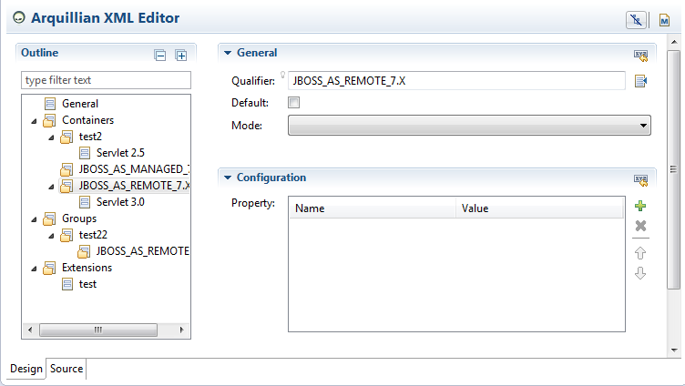

= Arquillian What's New in 4.2.0.Beta1
:page-layout: whatsnew
:page-component_id: arquillian
:page-component_version: 4.2.0.Beta1
:page-product_id: jbt_core 
:page-product_version: 4.2.0.Beta1

== Arquillian XML Editor 	

The Arquillian XML Editor makes Arquillian tests easier to configure.

 
The editor has been created using the Sapphire framework (http://www.eclipse.org/sapphire[]).
It includes the following features:

* editing arquillian artifacts (containers, groups, extensions, protocols and engines)
* proposing possible values of containers and protocols
* adding the required dependencies for containers and protocols

See http://screencast.com/t/058KgoS7ZK0[] and http://screencast.com/t/s16HzZEzmx[]

related_jira::JBIDE-16791[]
