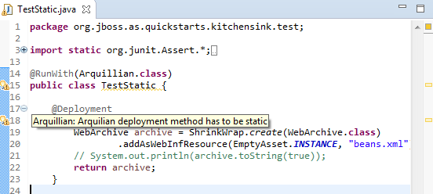

= Arquillian What's New in 4.2.1.Final
:page-layout: whatsnew
:page-component_id: arquillian
:page-component_version: 4.2.1.Final
:page-product_id: jbt_core 
:page-product_version: 4.2.1.Final

== Arquillian Validator

Adding a marker/quick fix when a test contains a non static deployment method

 
The Arquillian validator creates a  marker and a quick fix if a test contains a deployment method that is not public and/or static.

related_jira::JBIDE-16695[]
