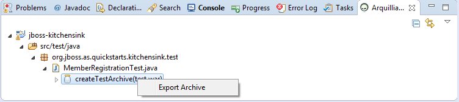
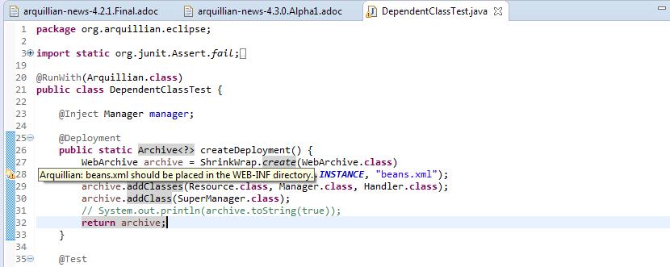
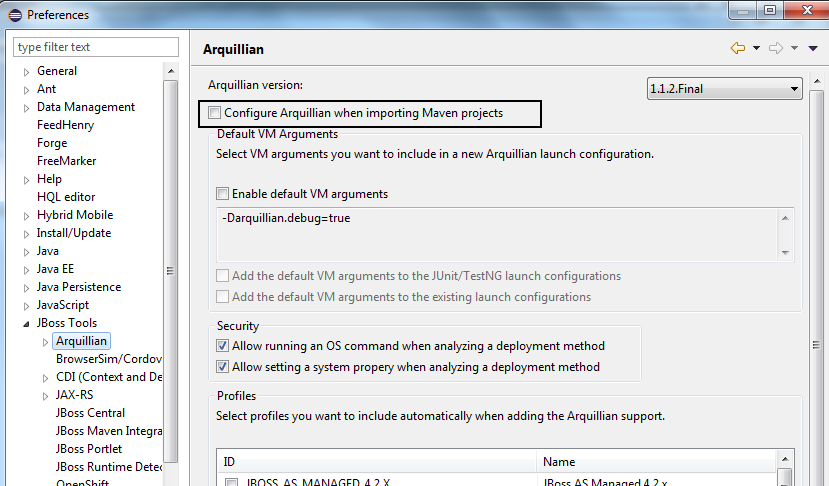

= Arquillian What's New in 4.3.0.Alpha1
:page-layout: whatsnew
:page-component_id: arquillian
:page-component_version: 4.3.0.Alpha1
:page-product_id: jbt_core
:page-product_version: 4.3.0.Alpha1

== Better support for the ShrinkWrap API in Generate Deployment

image::images/GenerateDeployment.png[]

Dependent classes for the same package are added with addClasses(...) instead of using addClass on each individual package.

related_jira::JBIDE-18270[]

== 'Export Archive' to Arquillian Cruiser view

An archive can be exported by right-clicking an archive entry in the Arquillia Cruiser view and selecting the Export Archive action.

related_jira::JBIDE-16385[]

== ShrinkWrap Archive file location validation

Arquillian warns that known EE descriptor files are not in the correct location.

related_jira::JBIDE-14782[]

== Maven configurator for arquillian

Arquillian now includes a Maven configurator that configures Arquillian capabilities if a project includes Arquillian classes.
The configurator is disabled by default.

related_jira::JBIDE-14427[]
