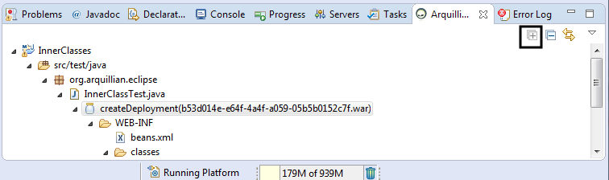

= Arquillian What's New in 4.3.0.CR1
:page-layout: whatsnew
:page-component_id: arquillian
:page-component_version: 4.3.0.CR1
:page-product_id: jbt_core 
:page-product_version: 4.3.0.CR1

== Arquillian JUnit Test Case wizard: Add dependent classes

The Arquillian JUnit Test Case wizard has an option to add dependent classes for a class under test

image::images/dependentClasses2.png[]

related_jira::JBIDE-20221[]

== Arquillian Cruiser: Arquillian Working Set Filter

The Arquillian Working Set Filter filter enables to show all the projects placed in the same working set as the selected project. 

related_jira::JBIDE-20220[]

== Arquillian Cruiser: Expand action

related_jira::JBIDE-20218[]
 