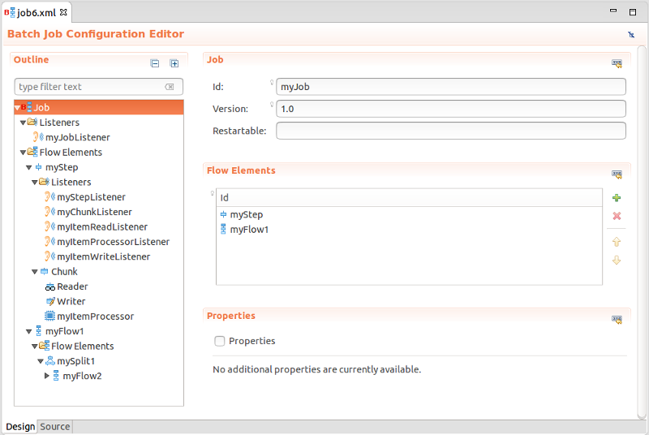

= Batch Tools What's New in 4.3.0.Alpha1
:page-layout: whatsnew
:page-component_id: batch
:page-component_version: 4.3.0.Alpha1
:page-product_id: jbt_core 
:page-product_version: 4.3.0.Alpha1

== Batch Job XML Editor

A new JavaEE 7 Batch job XML editor is available in JBoss Tools 4.3.0.Alpha1. The editor has two tabs:

- Tree form editor
- XML source editor

related_jira::JBIDE-18859[]