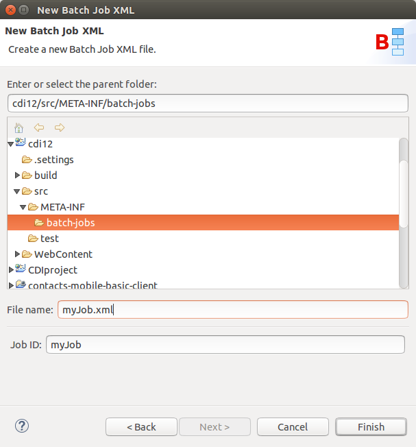
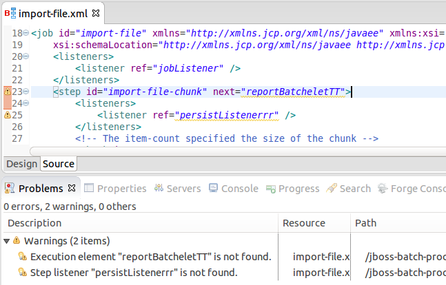
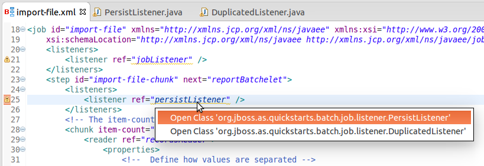
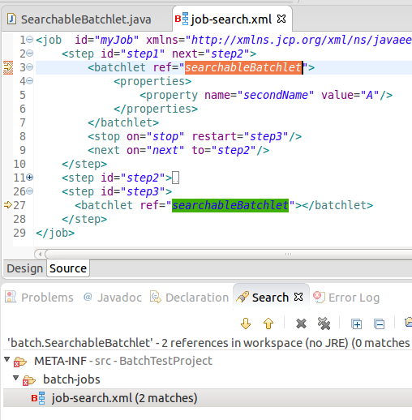
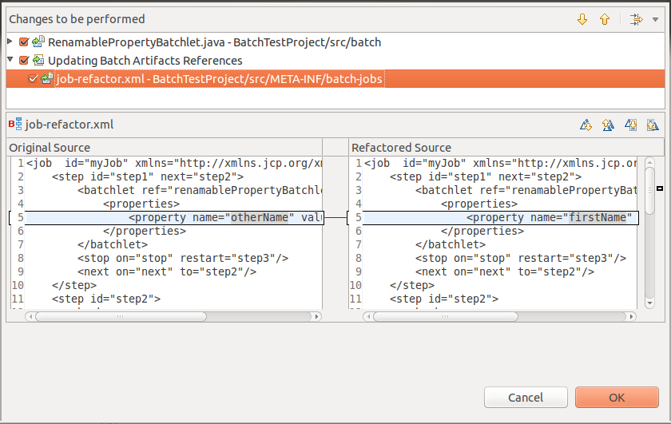

= Batch Tools What's New in 4.3.0.Alpha2
:page-layout: whatsnew
:page-component_id: batch
:page-component_version: 4.3.0.Alpha2
:page-product_id: jbt_core 
:page-product_version: 4.3.0.Alpha2

== New Batch Job XML Wizard

This new wizard creates a new Batch Job XML file:

related_jira::JBIDE-19516[]

== Validation

Batch artifact and property references are now validated in Job XML files:

related_jira::JBIDE-19158[]

== Content Assist

Job XML Editor is also now provides content assist for <* ref=""> <* next=""> <* to=""> <* restart=""> and for batch properties:

image::images/4.3.0.Alpha2/batchCA.png[]

related_jira::JBIDE-19268[]

== Hyperlink navigation (OpenOns) 

Batch artifacts can now be navigated to via OpenOn. Just press Ctrl and click on <* ref=""> <* next=""> <* to=""> <* restart=""> or property name to open the corresponding source code or Job XML element.

related_jira::JBIDE-19267[]

== Searching and Renaming Batch Artifacts 

Search for references (Ctrl+Shift+G) works for batch artifact classes and its property fields. For example if you have a batchlet class: 
----
@Named
public class SearchableBatchlet implements Batchlet {

	@Inject @BatchProperty(name="secondName") String otherName;
...
}
----
then results for SearchableBatchlet references will include the corresponding Job XML file:

When you rename some class name or property field then the corresponding Job XML references will be renamed too:

related_jira::JBIDE-19507[]
