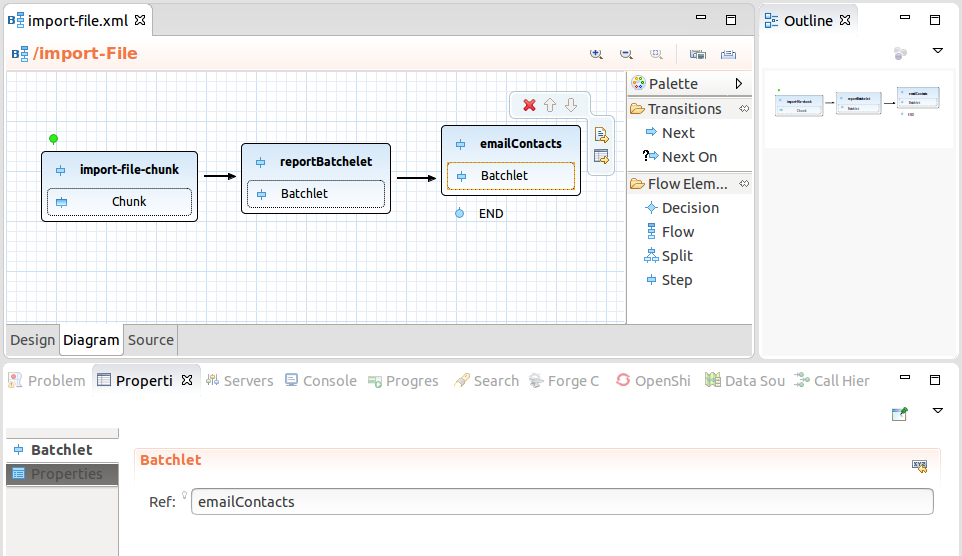
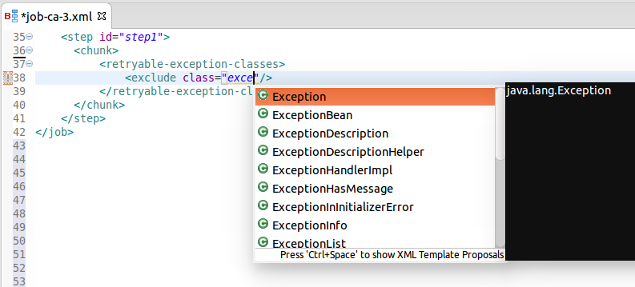
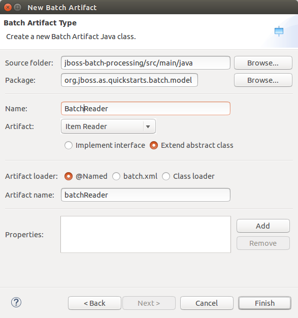

= Batch Tools What's New in 4.3.0.Beta1
:page-layout: whatsnew
:page-component_id: batch
:page-component_version: 4.3.0.Beta1
:page-product_id: jbt_core 
:page-product_version: 4.3.0.Beta1

== Visual (diagram) editor

A new diagram tab of Batch Job Configuration editor allows to graphically draw structure of a batch job XML file.

=== Features

* Visualization of structure of batch job, i.e.:
** step, flow, split, decision
** connection using next attribute and next elements
** end, stop and fail outcomes
** support for browsing nested flows
* Other properties editable via context actions and linked property views
* Setting a flow element as a start (i.e. reordering)
* Content proposal for batch artifacts

See a demo video:

video::wmWFQKvTWSc[youtube]

related_jira::JBIDE-19717[]

== Content assist for <* class=""> in Batch Job editor 

Content assist works for any _class_ attribute (used to reference exception classes). Just type the first letter of the class or name and the content assist will show all available proposals.

related_jira::JBIDE-19386[]

== New Batch Artifact wizard

A new Batch Artifact wizard is available in New->Others->Batch menu and allows to create batch artifacts, such as:
Batchlet, Checkpoint Algorithm, Decider, Item Reader, Item Writer, Item Processor, Partition Analyzer, Partition Reducer, Partition Collector, Partition Mapper, Partition Plan, Chunk Listener, Item Process Listener, Item Reader Listener, Item Writer Listener, Job Listener, Step Listener, Retry Process Listener, Retry Read Listener, Retry Write Listener, Skip Process Listener, Skip Listener, Skip Write Listener.

related_jira::JBIDE-18950[]