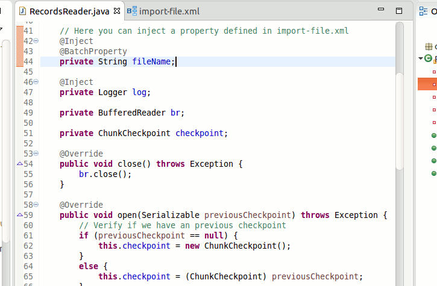
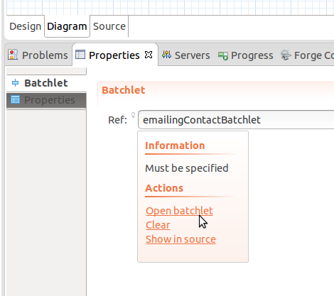
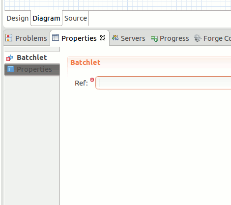

= Batch Tools What's New in 4.3.0.Beta2
:page-layout: whatsnew
:page-component_id: batch
:page-component_version: 4.3.0.Beta2
:page-product_id: jbt_core 
:page-product_version: 4.3.0.Beta2

== Hyperlinks for @BatchProperty

It's now possible to navigate (Ctrl+Click) from injection points annotated @BatchProperty to the corresponding property references:

related_jira::JBIDE-19700[]

== Navigation to Batch artifacts from properties editor 

To navigate from Properties editor to the corresponding batch artifact click on the icon at the property name and select 'Open <artifact>'.

If there are no artifact yet then there will be a 'Create <artifact>' link which when clicked opens 'New Batch Artifact' wizard. 

related_jira::JBIDE-20005[]