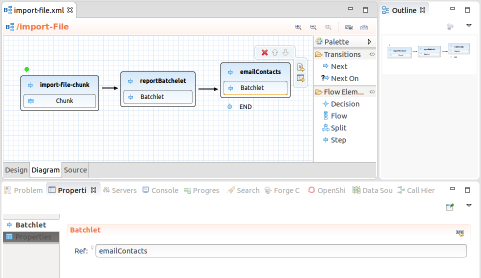

= Batch Tools What's New in 4.3.0.Final
:page-layout: whatsnew
:page-component_id: batch
:page-component_version: 4.3.0.Final
:page-product_id: jbt_core
:page-product_version: 4.3.0.Final
:page-include-previous: false

== Batch Job XML Editor

A new JavaEE 7 Batch job XML editor is available in JBoss Tools 4.3. The editor has three tabs:

- Tree form editor
- Visual (diagram) editor
- XML source editor

related_jira::JBIDE-18859[]

=== Visual (diagram) editor features

* Visualization of structure of batch job, i.e.:
** step, flow, split, decision
** connection using next attribute and next elements
** end, stop and fail outcomes
** support for browsing nested flows
* Other properties editable via context actions and linked property views
* Setting a flow element as a start (i.e. reordering)
* Content proposal for batch artifacts

See a demo video:

video::wmWFQKvTWSc[youtube]

related_jira::JBIDE-19717[]

=== Content Assist

Job XML Editor provides content assist for <* ref="">, <* next="">, <* to="">, <* restart=""> and for batch properties:

image::images/4.3.0.Alpha2/batchCA.png[]

related_jira::JBIDE-19268[]

Content assist also works for any _class_ attribute (used to reference exception classes). Just type the first letter of the class or name and the content assist will show all available proposals.

image::images/4.3.0.Beta1/ca.png[]

related_jira::JBIDE-19386[]

=== Hyperlink navigation (OpenOns)

Batch artifacts can be navigated to via OpenOn. Just press Ctrl and click on <* ref="">, <* next="">, <* to="">, <* restart=""> or property name to open the corresponding source code or Job XML element.

image::images/4.3.0.Alpha2/openOn.png[]

related_jira::JBIDE-19267[]

To navigate from the Properties editor to the corresponding batch artifact, click the icon at the property name and select 'Open <artifact>'.

image::images/4.3.0.Beta2/open.png[]

If no artifacts are included, click the 'Create <artifact>' link. This starts the 'New Batch Artifact' wizard.

image::images/4.3.0.Beta2/create.gif[]

related_jira::JBIDE-20005[]

It is also possible to navigate (Ctrl+Click) from injection points annotated @BatchProperty to the corresponding property references:

image::images/4.3.0.Beta2/openon.gif[]

related_jira::JBIDE-19700[]

== Validation

Batch artifact and property references are validated in Job XML files:

image::images/4.3.0.Alpha2/validation.png[]

related_jira::JBIDE-19158[]

There are Quick Fixes available for the following validation problems:

- "Batchlet "<batchlet-name>" is not found"
- "Checkpoint algorithm "<checkpointalgorithm-name>" is not found"
- "Decider "<decider-name>" is not found"
- "Item Processor "<itemprocessor-name>" is not found"
- "Item Reader "<itemreader-name>" is not found"
- "Item Writer "<itemwriter-name>" is not found"
- "Job listener "<joblistener-name>" is not found"
- "Partition Analyzer "<partitionanalyzer-name>" is not found"
- "Partition Collector "<partitioncollector-name>" is not found"
- "Partition Mapper "<partitionmapper-name>" is not found"
- "Partition Reducer "<partitionreducer-name>" is not found"
- "Step listener "<steplistener-name>" is not found"

The Quick Fixes open a pre-set New Batch Artifact wizard to create the missing artifact:

image::images/4.3.0.CR1/qf.png[]

related_jira::JBIDE-19266[]

== Searching and Renaming Batch Artifacts

Search for references (Ctrl+Shift+G) works for batch artifact classes and its property fields. For example if you have a batchlet class:
----
@Named
public class SearchableBatchlet implements Batchlet {

	@Inject @BatchProperty(name="secondName") String otherName;
...
}
----
then results for SearchableBatchlet references will include the corresponding Job XML file:

image::images/4.3.0.Alpha2/search.png[]

When you rename some class name or property field then the corresponding Job XML references will be renamed too:

image::images/4.3.0.Alpha2/refactor.png[]

related_jira::JBIDE-19507[]

== New Batch Job XML Wizard

New Batch Job XML wizard is available in New->Others->Batch menu and creates a new Batch Job XML file:

image::images/4.3.0.Alpha2/batchJobWizard.png[]

related_jira::JBIDE-19516[]

== New Batch Artifact wizard

This wizard allows to create batch artifacts, such as:

* Batchlet
* Checkpoint Algorithm
* Decider
* Item Reader
* Item Writer
* Item Processor
* Partition Analyzer
* Partition Reducer
* Partition Collector
* Partition Mapper
* Partition Plan
* Chunk Listener
* Item Process Listener
* Item Reader Listener
* Item Writer Listener
* Job Listener
* Step Listener
* Retry Process Listener
* Retry Read Listener
* Retry Write Listener
* Skip Process Listener
* Skip Listener
* Skip Write Listener.

image::images/4.3.0.Beta1/artifact.png[]

related_jira::JBIDE-18950[]

== Performance improvements

We have fixed a critical performance issue with JBoss Knowledge Base builder for project with large JAR libraries that contain Batch artifacts.
For example, if your Maven project has a dependency on glassfish-embedded-all.jar then it could take more than 5 minutes to build the project just because of this dependency. Now, it takes seconds.

related_jira::JBIDE-20593[]
