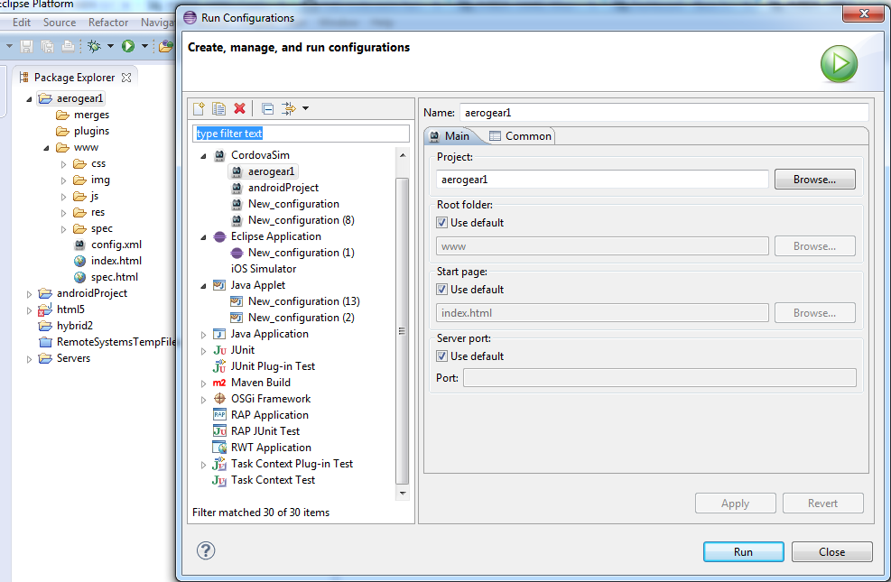

= BrowserSim/CordovaSim What's New in 4.1.0.Beta1
:page-layout: whatsnew
:page-component_id: browsersim
:page-component_version: 4.1.0.Beta1
:page-product_id: jbt_core 
:page-product_version: 4.1.0.Beta1

== CordovaSim
=== New CordovaSim Application

CordovaSim is a simulator of http://cordova.apache.org/[Apache Cordova] (aka PhoneGap) environment based on BrowserSim and http://ripple.incubator.apache.org/[Ripple]. It emulates main APIs of Apache Cordova such as Accelerometer, Geolocation, Camera, https://github.com/wildabeast/BarcodeScanner[Barcode Scanner], etc.

image::images/4.1.0.Beta1/CordovaSim-demo.png[CordovaSim in action]

There is CordovaSim Launch configuration which can run Hybrid Mobile projects and Cordova enabled Android projects.

The Launch Configuration is also available from the Run As context menu.

image::images/4.1.0.Beta1/CordovaSim-run-as.png[Run As CordovaSim]

related_jira::JBIDE-13552,JBIDE-14362,JBIDE-14300,JBIDE-14383[]

== BrowserSim
=== LiveReload support

If you enable LiveReload BrowserSim will inject livereload.js into html pages it load. Making it automatically load if the url is managed by a livereload server such as JBoss Tools new LiveReload plugin.

image::images/4.1.0.Beta1/BrowserSim-livereload.png[Enable Livereload]

related_jira::JBIDE-14360[]

=== Synchonized Windows

Now you can open more than one BrowserSim windows which work synchronously. It provides ability to see multiple devices rendering the same page, repeat your navigation steps and when reload it reloads all of them. Synchronized window can be opened via Menu > Open Synchronized Window > skin_to_open

image::images/4.1.0.Beta1/BrowserSim-open-synchronized.png[Open Synchronized Window]

As a result of this action two devices working synchronously will appear.

image::images/4.1.0.Beta1/BrowserSim-opened-synchronized.png[Synchronized Windows]

related_jira::JBIDE-13525[]
