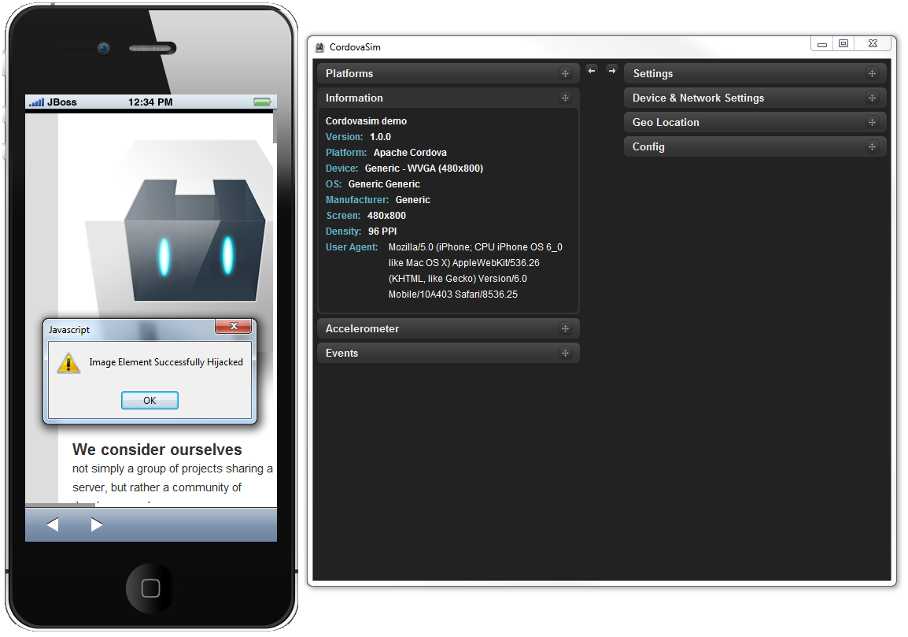

= BrowserSim and CordovaSim What's New in 4.1.1.CR1
:page-layout: whatsnew
:page-component_id: browsersim
:page-component_version: 4.1.1.CR1
:page-product_id: jbt_core 
:page-product_version: 4.1.1.CR1

== InAppBrowser plugin support in CordovaSim

Now CordovaSim is able to simulate the inAppBrowser API. The InAppBrowser is a web browser view that displays when calling window.open(). The InAppBrowser window behaves like a standard web browser, and cannot access Cordova APIs.

related_jira::JBIDE-15512[]

== ChildBrowser plugin support in CordovaSim

Now CordovaSim has ChildBrowser plugin support. ChildBrowser plugin is considered to be deprecated (InAppBrowser is an up-to-date substitution), nevertheless it's one of the most popular plugins overall.

image::images/4.1.1.CR1/child-browser.png[CordovaSim running Twitter OAuth example using ChildBrowser API]

related_jira::JBIDE-13743[]