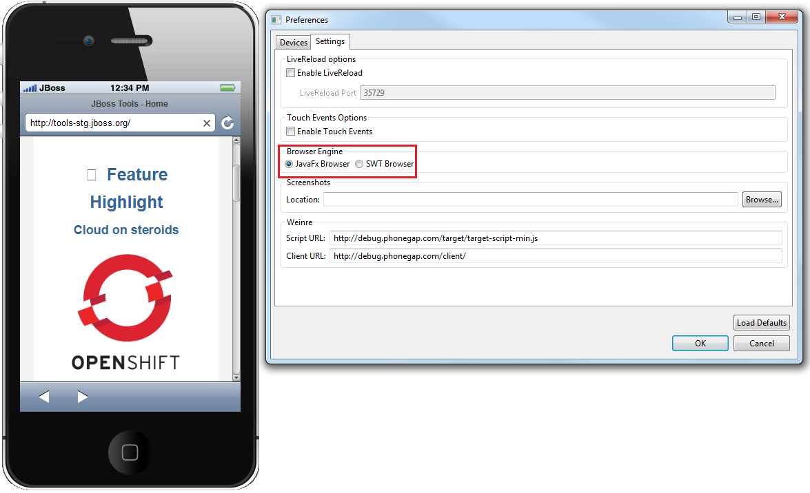
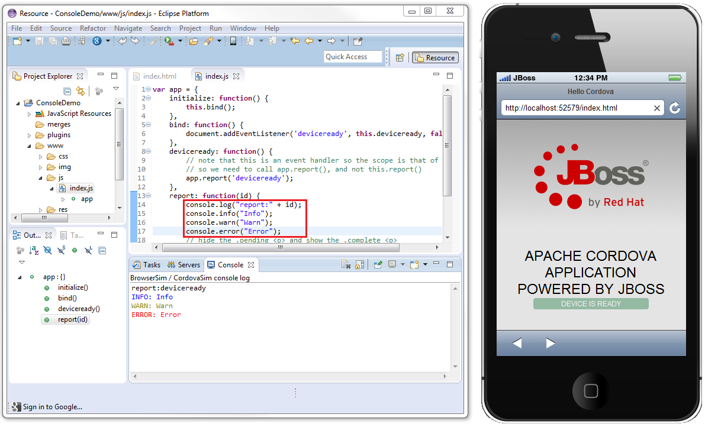

= BrowserSim and CordovaSim What's New in 4.2.0.Alpha2
:page-layout: whatsnew
:page-component_id: browsersim
:page-component_version: 4.2.0.Alpha2
:page-product_id: jbt_core 
:page-product_version: 4.2.0.Alpha2

== BrowserSim

=== JavaFx Web Engine

BrowserSim and CordovaSim have a new JavaFx web engine as an alternative to SWT WebKit engine. Web engine can be changed in *Menu > Preferences > Browser Engine*. This option is available for Windows and Mac OS users. Linux is currently not supported.

related_jira::JBIDE-15640[]

=== Chrome Debugger

Chrome Dev Tools Debugger is now available for BrowserSim / CordovaSim. This option is enabled only for JavaFx Web Engine and can be treated as a replacement of the Firebug Lite. Dev Tools Debugger can be enabled via *Menu > Debug > Dev Tools...*

image::images/4.2.0.Alpha2/chrome-debugger.png[Chrome Debugger]

related_jira::JBDS-2866[]

=== Eclipse Console Logging

Now the output of the main javascript console functions (console.log, console.info, console.warn, console.error) is displayed in the Eclipse console. This option is available only for SWT.WEBKIT for now.

related_jira::JBIDE-16485,JBIDE-16587[]
