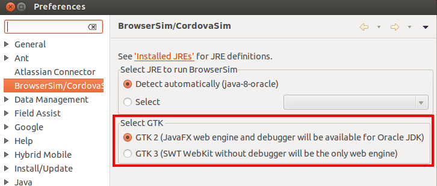

= BrowserSim and CordovaSim What's New in 4.2.0.Beta1
:page-layout: whatsnew
:page-component_id: browsersim
:page-component_version: 4.2.0.Beta1
:page-product_id: jbt_core 
:page-product_version: 4.2.0.Beta1

== JavaFx web engine and debugger support on Linux

Now there is a Linux specific option (enabled by default) to enable GTK2 for the process launched by BrowserSim / Cordovasim. It allows using javaFx web engine and debugger on Linux:

related_jira::JBIDE-16732[]

== Multiple version support for Cordovasim

Now Cordovasim uses the same engine (cordova.js) as HMT (Hybrid Mobile Tools) and handles it in an appropriate way:

related_jira::JBIDE-16390[]

== Eclipse logging for JavaFx web engine

Now the output of the main javascript console functions (console.log, console.info, console.warn, console.error) is displayed in the Eclipse console. The option is now available for both SWT WebKit and JavaFx web engines:

related_jira::JBIDE-16587[]

== Battery Status support

Now CordovaSim has Battery Status support. It gives the ability to simulate batterystatus, batterylow and batterycritical link:http://docs.phonegap.com/en/3.4.0/cordova_events_events.md.html#Events[events].

related_jira::JBDS-2858[]