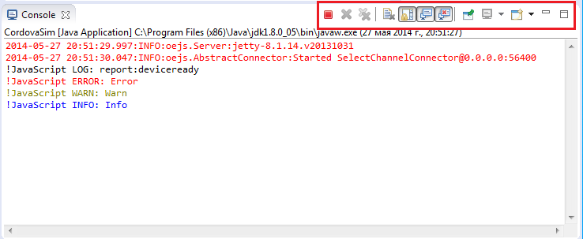

= BrowserSim and CordovaSim What's New in 4.2.0.Beta2
:page-layout: whatsnew
:page-component_id: browsersim
:page-component_version: 4.2.0.Beta2
:page-product_id: jbt_core 
:page-product_version: 4.2.0.Beta2

== Easier usage of JavaFx web engine and debugger support on Microsoft Windows 64-bit

JavaFx is an alternative to SWT WebKit and enables Windows users to run BrowserSim and CordovaSim without having to install Safari and run these features with a 32-bit Java developer kit. 

In past 32-bit was assumed/forced giving problems for users on 64-bit Windows. Now the BrowserSim and CordovaSim will be launched with the appropriate version without the user to start.

If you are on 32-bit Windows you can still install Safari to use SWT WebKit if preferred.

related_jira::JBIDE-17258[]

== Process launch console output for BrowserSim / CordovaSim

Process launch console output is implemented for both SWT WebKit and JavaFx web engines. Not only the output of the main javascript console functions (console.log, console.info, console.warn, console.error) is displayed in the Eclipse console, but also logs and errors of the process. Also user can manipulate console (*Pin Console*, *Scroll Lock*, etc.) and close BrowserSim / CordovaSim via *Terminate* button.

related_jira::JBIDE-16661[]

== Linked folders support for CordovaSim

http://help.eclipse.org/kepler/index.jsp?topic=%2Forg.eclipse.platform.doc.user%2Ftasks%2Ftasks-45.htm[Linked folders] are honored when project is run on CordovaSim.

related_jira::JBIDE-16931[]

== Query parameters support for CordovaSim

CordovaSim now supports query parameters for the start page in *launch configuration* and via *content* tag in the config.xml.

image::images/4.2.0.Beta2/query-parameters.png[Query parameters support]

related_jira::JBIDE-16388,JBIDE-16389[]
