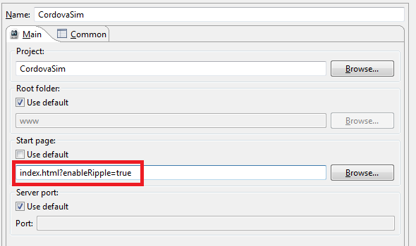

= BrowserSim and CordovaSim What's New in 4.2.0.Beta2
:page-layout: whatsnew
:page-component_id: browsersim
:page-component_version: 4.2.0.Beta2
:page-product_id: jbt_core 
:page-product_version: 4.2.0.Beta2

== BrowserSim and Cordovasim are now available OOTB for 64 bit Eclipse on Windows, with JavaFx WebEngine

Now BrowserSim and Cordovasim are available OOTB for 64 bit Eclipse on Windows with JavaFx web engine (SWT WebKit is not supported). User had to manually add 32 bit JDK in order to run BrowserSim / CordovaSim against Eclipse 64 bit on Windows before, which was not user-friendly. Windows 32 bit still supports both JavaFx and SWT WebKit.

related_jira::JBIDE-17258[]

== Process launch console output for BrowserSim / CordovaSim

Process launch console output is implemented for both SWT WebKit and JavaFx web engines. Not only the output of the main javascript console functions (console.log, console.info, console.warn, console.error) is displayed in the Eclipse console, but also logs and errors of the process. Also user can manipulate console (*Pin Console*, *Scroll Lock*, etc.) and close BrowserSim / CordovaSim via *Terminate* button.

image::images/4.2.0.Beta2/process-console-logging.png[Process launch console output]

related_jira::JBIDE-16661[]

== Linked folders support for CordovaSim

http://help.eclipse.org/kepler/index.jsp?topic=%2Forg.eclipse.platform.doc.user%2Ftasks%2Ftasks-45.htm[Linked folders] are honored when project is run on CordovaSim for now.

related_jira::JBIDE-16931[]

== Query parameters support for CordovaSim

Cordovasim now supports query parameters for the start page in *launch configuration* and via *content* tag in the config.xml.

related_jira::JBIDE-16388,JBIDE-16389[]