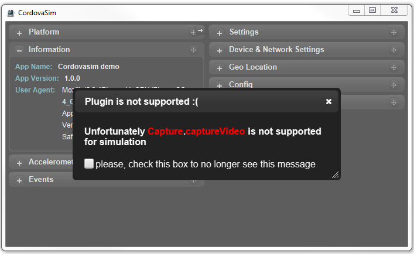
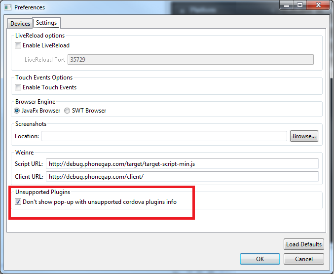

= BrowserSim and CordovaSim What's New in 4.2.0.Beta3
:page-layout: whatsnew
:page-component_id: browsersim
:page-component_version: 4.2.0.Beta3
:page-product_id: jbt_core 
:page-product_version: 4.2.0.Beta3

== Improving the way of handling unsupported plug-ins in CordovaSim

Now every time when CordovaSim can't handle a plug-in, the following prompt is displayed:

Notifications can also be disabled in the `Settings` tab of CordovaSim's preferences :

related_jira::JBIDE-17588[]
