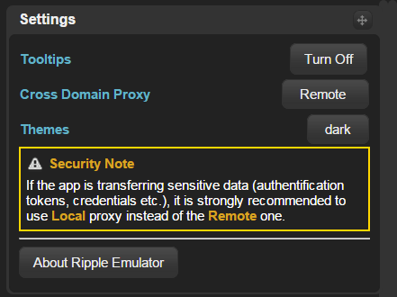

= BrowserSim and CordovaSim What's New in 4.2.3.Beta1
:page-layout: whatsnew
:page-component_id: browsersim
:page-component_version: 4.2.3.Beta1
:page-product_id: jbt_core 
:page-product_version: 4.2.3.Beta1

== Basic FeedHenry support for CordovaSim

CordovaSim has gained basic http://www.feedhenry.com/[FeedHenry] support. Now it is possible to run http://www.feedhenry.com/[FeedHenry] hybrid apps against both `local` and `remote` Node.js server:

image::images/4.2.3.Beta1/basic-fh-support.png[Basic FeedHenry support]

related_jira::JBIDE-19152[]

== Security note for "Remote" proxy in CordovaSim

Now there is a security warning for *"Remote"* proxy. Basically, If the app is transferring sensitive data (authentication tokens, credentials etc.), it is strongly recommended  to use *"Local"* proxy (enabled by default) instead of the *"Remote"* one. 
 

related_jira::JBIDE-19163[]
