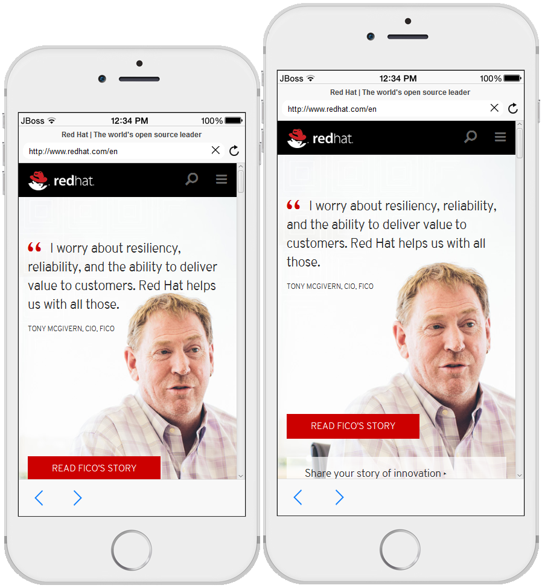
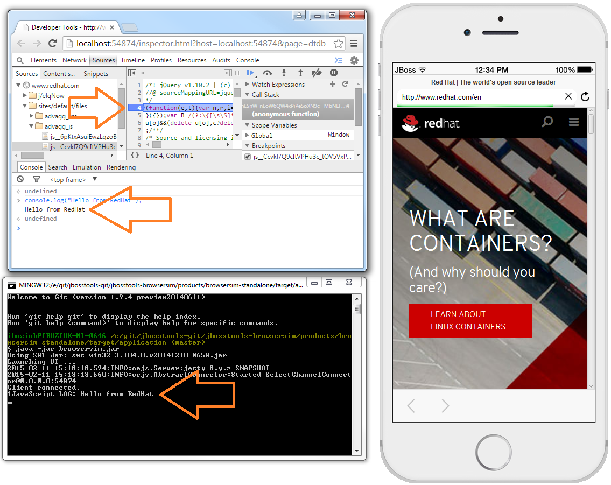
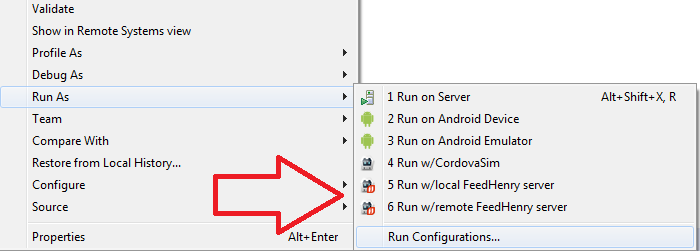
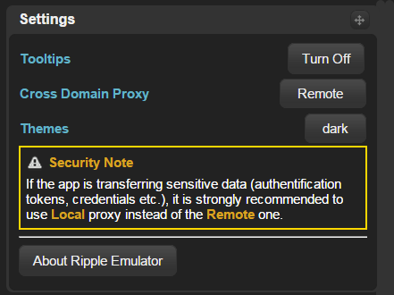

= BrowserSim and CordovaSim What's New in 4.3.0.Alpha1
:page-layout: whatsnew
:page-component_id: browsersim
:page-component_version: 4.3.0.Alpha1
:page-product_id: jbt_core 
:page-product_version: 4.3.0.Alpha1

== IPhone 6 / 6 plus skin

Brand new IPhone 6 / 6 plus skin is now available in BrowserSim and CordovaSim:

related_jira::JBIDE-18874,JBIDE-18875[]

== JavaFx web engine support for BrowserSim standalone 

For one who does not use Eclipse / JBoss Developer Studio there is a standalone mode of BrowserSim. However, only `SWT WebKit` web engine used to be supported. Now there is a possibility to run BrowserSim standalone against `JavaFx` web engine which provides features like *Dev Tools Debugger* and *JavaScript logging* in the console.

related_jira::JBIDE-18703[]

== Basic FeedHenry support for CordovaSim

CordovaSim has gained basic http://www.feedhenry.com/[FeedHenry] support. Now it is possible to run http://www.feedhenry.com/[FeedHenry] hybrid apps against both `local` and `remote` Node.js server:

related_jira::JBIDE-18900[]

== Saving all CordovaSim preferences on close

From now on all specific preferences (UI themes, tabs order, settings, etc.) are saved on CordovaSim close. 

related_jira::JBIDE-18732[]

== Security note for "Remote" proxy in CordovaSim

Now there is a security warning for *"Remote"* proxy. Basically, If the app is transferring sensitive data (authentication tokens, credentials etc.), it is strongly recommended  to use *"Local"* proxy instead of the *"Remote"* one. 
 

related_jira::JBIDE-19094[]
