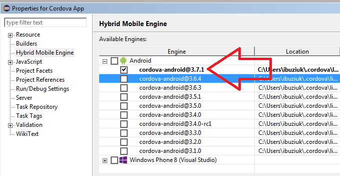

= BrowserSim and CordovaSim What's New in 4.3.0.Alpha2
:page-layout: whatsnew
:page-component_id: browsersim
:page-component_version: 4.3.0.Alpha2
:page-product_id: jbt_core 
:page-product_version: 4.3.0.Alpha2

== Individual platform releases support for CordovaSim

Apache Cordova Project is now doing individual releases per platform (Android / Windows Phone / IOS). This functionality is now available for CordovaSim. One can specify cordova engine via *Properties -> Hybrid Mobile Engine*:

related_jira::JBIDE-19426,JBIDE-19471[]
