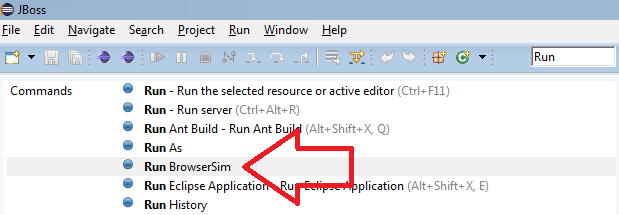

= BrowserSim and CordovaSim What's New in 4.3.0.Beta1
:page-layout: whatsnew
:page-component_id: browsersim
:page-component_version: 4.3.0.Beta1
:page-product_id: jbt_core 
:page-product_version: 4.3.0.Beta1

== BrowserSim is now available in the "Quick Access"

Now the "Run BrowserSim" command is available in the "Quick Access" for every single perspective:

related_jira::JBIDE-12108[]

== Cheet Sheets improvement for BrowserSim

Now an optional `url` parameter can be added to the BrowserSim command when writing http://help.eclipse.org/indigo/index.jsp?topic=/org.eclipse.platform.doc.isv/guide/ua_cheatsheet_guidelines.htm[Cheet Sheets]. The usage is the following:
[source,xml]
----
<command
	required="false"
	serialization="org.jboss.tools.vpe.browsersim.eclipse.commands.runBrowserSim(url=http://example.com/)"/>
----

related_jira::JBIDE-15884[]