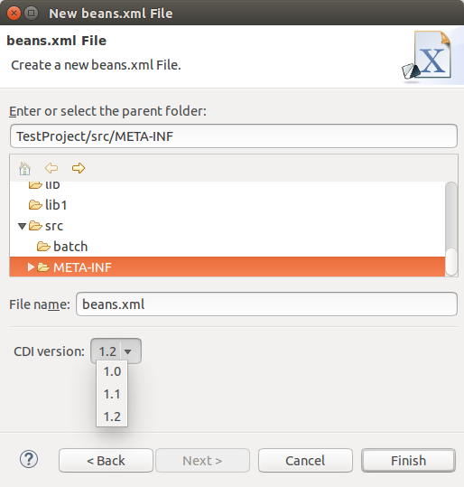

= CDI Tools What's New in 4.3.0.Alpha1
:page-layout: whatsnew
:page-component_id: cdi
:page-component_version: 4.3.0.Alpha1
:page-product_id: jbt_core
:page-product_version: 4.3.0.Alpha1

== CDI 1.2

CDI Tools now support CDI 1.2 projects. If your CDI project (with enabled CDI support) has CDI 1.2 JARs in its classpath, CDI Tools recognizes it as CDI 1.2 project automatically. There is no need to use any special settings to distinguish CDI 1.2 from CDI 1.1 or 1.0.

related_jira::JBIDE-17923[]

== Multiple Versions in New beans.xml Wizard

The new beans.xml wizard allows to choose the CDI version: 1.0, 1.1 or 1.2

related_jira::JBIDE-18584[]

== CDI Auto Enablement for JavaEE 7 Projects

CDI Tools now automatically enables CDI support for the project when the following Java EE 7 facets are installed: Web (Servlet) 3.1 or higher, EJB 3.2 or higher or Utility module.
For example, if you create a brand new Web Dynamic project with Web (Servlet) version 3.1 and any Java EE 7 targeting server, CDI support is automatically enabled.
Additionally, JBoss Tools still enables CDI support for the maven projects if the project has CDI dependencies. However, this feature is only avaialble when the Maven CDI integration plugin is installed.

related_jira::JBIDE-18592[]

== Proper Validation Problem Messages Dependent on CDI Version

Each CDI validation problem message refers to the corresponding CDI specification paragraph. Message and specification referrals now depend on the CDI version used in the project.
For example:

1. "There is no class "org.domain.ClassName" [JSR-299 §8.2]" - CDI 1.0 validation message for non-existing class in beans.xml
2. "There is no class "org.domain.ClassName" [JSR-346 §8.2]" - CDI 1.1 validation message

related_jira::JBIDE-18750[]
