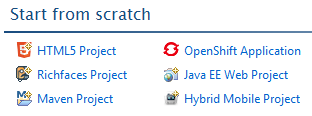
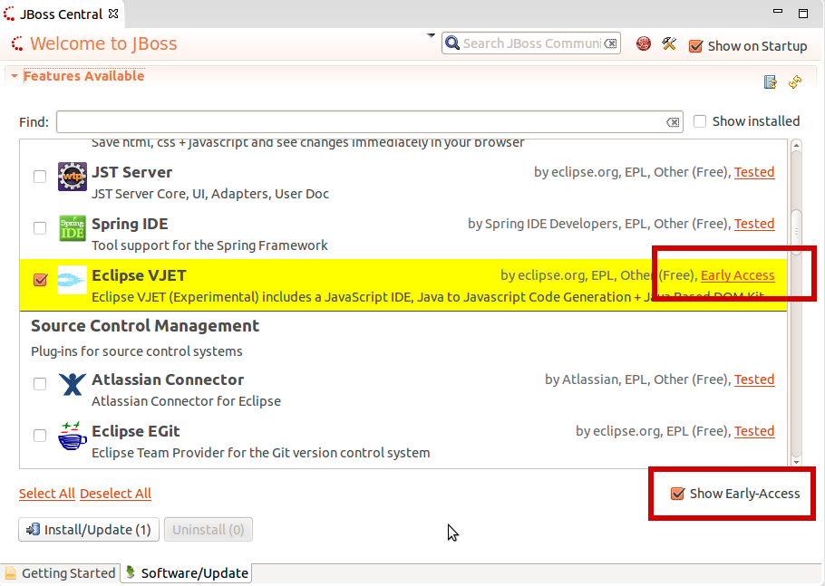
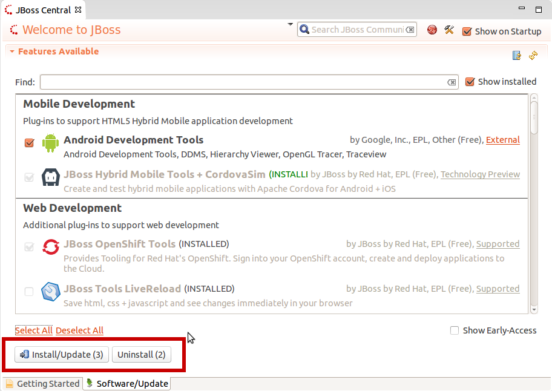

= JBoss Central What's New in 1.3.0.Beta2
:page-layout: whatsnew
:page-component_id: central
:page-component_version: 1.3.0.Beta2
:page-product_id: jbt_core 
:page-product_version: 4.2.0.Beta2

== New Hybrid Mobile project wizard 	

JBoss Central now features the Hybrid Mobile Project wizard to let you kickstart new Cordova-based mobile applications. 

If the Hybrid Mobile Toolkit is not installed, you'll be asked to install it, as well as a few useful companion features (CordovaSim, BrowserSim). When using JBoss Tools you'll also be offered to add LiveReload and the Visual Plugin Editor, if these features are not already installed. 

The Spring Project wizard, that was previously featured on JBoss Central, is still available in the File > New > Project... menu.

related_jira::JBIDE-16837[]

== Early Access

We introduced the concept of 'Early Access' features that can be installed from the 'Software/Updates' tab of JBoss Central. These features
are usually experimental or still being developed, so they may contain bugs and may not yet behave correctly.

To support these new incubating features, we've updated the JBoss Central view.

=== Related UI changes

On the 'Software/Updates' tab of JBoss Central, you can now see a 'Show Early Access' checkbox. Once selected, a disclaimer on the unsupported nature of the features you're about to access will pop up. If you agree to it, the 'Early Access' features will be added to the list of available features. You can
easily differentiate them thanks to their yellow background and their 'Early Access' label at the right of the description.

These Early Access features can be installed and uninstalled just like regular features. Doing so will enable additional software sources from which these incubating components can be installed. Be aware that when updating Eclipse, this may install/update unexpected features.

related_jira::JBIDE-16375[]

=== Available features

The following features were moved or added as part of the 'Early Access' 

* Eclipse VJET : includes a JavaScript IDE, Java to Javascript Code Generation + Java Based DOM Kit
* Arquillian Tools : Create, manage and run integration tests with Arquillian
* AngularJS Eclipse : see next section

related_jira::JBIDE-17318[]

=== AngularJS Eclipse

https://github.com/angelozerr/angularjs-eclipse#angularjs-eclipse-plugin[AngularJS Eclipse Plugin] extends Eclipse WTP to provide :

* an HTML editor which supports AngularJS expression and directive. See https://github.com/angelozerr/angularjs-eclipse/wiki/HTML-Features[HTML features] for more informations.
* an https://github.com/angelozerr/angularjs-eclipse/wiki/Angular-Explorer-View[Angular Explorer] view which displays modules, controllers of your project in a tree.
* a Javascript editor which supports AngularJS features (modules, etc). See https://github.com/angelozerr/angularjs-eclipse/wiki/Javascript-Features[Javascript features] for more informations.

image::https://github.com/angelozerr/angularjs-eclipse/wiki/images/HTMLAngularEditorOverview.png[]

AngularJS Eclipse relies on the https://github.com/angelozerr/tern.java#ternjava[tern.java plugin] to manage powerful completion on HTML files (AngularsJS Expression, directives, modules) and Javascripts files (see https://github.com/angelozerr/tern.java/wiki/Tern-Eclipse-IDE#tern---eclipse-ide[Tern Eclipse IDE]).

If you start with AngularJS Eclipse, please read this https://github.com/angelozerr/angularjs-eclipse/wiki/Getting-Started[Getting Started].

related_jira::JBIDE-17278[]

== Update and uninstall software from JBoss Central

From the same 'Software/Updates' page that you used to install additional features, you can now update selected features to a newer version,
if one is available, or uninstall them.

related_jira::JBIDE-16592[]