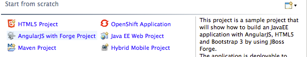

= JBoss Central What's New in 1.3.0.CR1
:page-layout: whatsnew
:page-component_id: central
:page-component_version: 1.3.0.CR1
:page-product_id: jbt_core 
:page-product_version: 4.2.0.CR1

== New AngularJS with Forge project wizard 	

JBoss Central now features a new AngularJS with Forge project wizard to let you kickstart new JavaEE based applications with HTML5 and AngularJS for the front-end, while using the powerful http://forge.jboss.org/[JBoss Forge] scaffolding capabilities.

If the Forge Tool is not installed, you'll be asked to install it. The wizard will also recommend you to install the AngularJS tooling.

Once you create the project skeleton from the new wizard, a cheatsheet will open and guide you through through the different steps necessary to use JBoss Forge and scaffold a UI layer based on AngularJS. 

The Richfaces Project wizard, that was previously featured on JBoss Central, is still available in the `File > New > Project...` menu.

related_jira::JBIDE-16837[]

