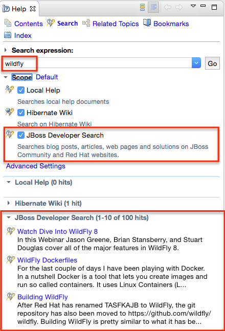
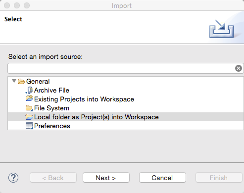

= JBoss Central What's New in 2.0.0.Alpha2
:page-layout: whatsnew
:page-component_id: central
:page-component_version: 2.0.0.Alpha2
:page-product_id: jbt_core
:page-product_version: 4.3.0.Alpha2

== JBoss Developer Search available directly from Eclipse Help

We have added http://dcp.jboss.org/ as a search Engine for Eclipse Help search.

Any term you search in the `Help > Search` window will now be searched through references in all
indexed JBoss articles and blogs :

related_jira::JBIDE-19272[]

== Smart(er) project import

We've contributed a new import framework to Eclipse Mars, a.k.a. https://wiki.eclipse.org/E4/UI/Smart_Import[Smart Import].
The purpose of that framework is to automatically detect what is a project and automatically configure it, upon import,
with very minimal effort from the user.

For instance, if you open a folder containing a pom.xml file, it will be automatically inferred you're trying to import
a Maven project, so the underlying m2e import mechanism will be invoked.

This new feature is currently still in incubation at Eclipse.org, but we're including it as a preview,
as part of the JBoss Central Experience.

You can go to `Import > General > Local folder as Project(s) into Workspace`

Curently, the following types of projects are supported, and can be configured automatically on folder import :

- Maven
- Cordova
- Java EE
- Eclipse Plug-ins
- Javascript

Eventually, eGit will be able to leverage this mechanism to automatically import projects after cloning a git repository.

related_jira::JBDS-3285[]
