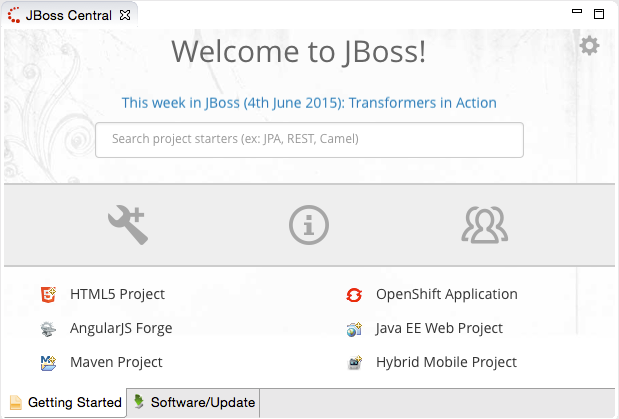
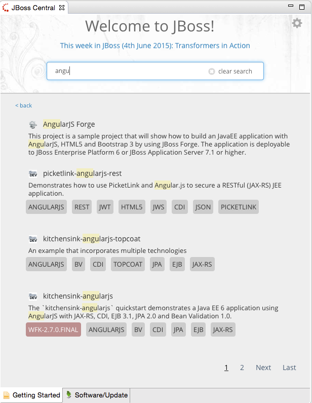

= JBoss Central What's New in 2.0.0.Beta1
:page-layout: whatsnew
:page-component_id: central
:page-component_version: 2.0.0.Beta1
:page-product_id: jbt_core
:page-product_version: 4.3.0.Beta1

== New and improved JBoss Central page

In this release, we're introducing an slick, http://english.stackexchange.com/questions/19689/is-new-and-improved-an-oxymoron[new and improved]
 JBoss Central, to greet you in your workspace. This is actually an HTML-based page, designed to give you instant access to a treasure trove of JBoss Developer materials.
 From top to bottom, you have access to :

 * the latest news/blog posts about JBoss technologies, cycling in a carousel
 * a search engine for project examples, similar to the one in http://www.jboss.org/developer-materials/
 * links to :
 ** the software update page, where you can install new Eclipse features that have been tested to work with JBoss Tools,
 ** the http://www.jboss.org/developer-materials/ website,
 ** the http://tools.jboss.org/cat/[Community Acceptance testing] page, where you can learn how to help make JBoss Tools better,
 * Finally, the lowest section will display common wizards and the list of recently used examples, helping you to start new projects in a jiffy.

As for the search feature, you now get access to about 200 quickstarts, filtered with zero latency as you type :

Clicking on a given tag will perform a search using that tag's label.

We're pretty happy with the way the new JBoss Central page gracefully adapts to lower resolutions, thanks to the use of the http://getbootstrap.com/[Bootstrap framework] under the hood. We really hope you'll appreciate it as well.
Please don't hesitate to provide your feedback.

related_jira::JBDS-3272[]
