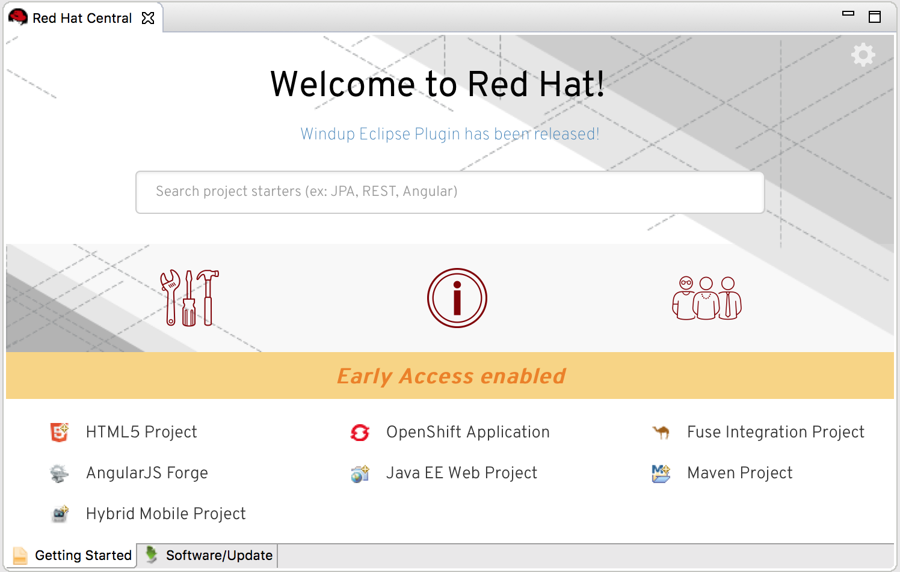

= Red Hat Central What's New in 2.1.3.Final
:page-layout: whatsnew
:page-component_id: central
:page-component_version: 2.1.3.Final
:page-product_id: jbt_core
:page-product_version: 4.4.3.Final

== Updated Red Hat Central Experience

Red Hat Central, designed to provide instant access to a large variety of http://www.jboss.org/get-started/[JBoss Developer] material, has been given a fresh look, matching Red Hat’s color theme:

related_jira::JBIDE-22999[]
