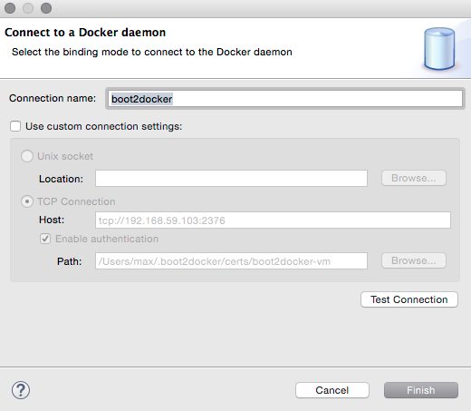
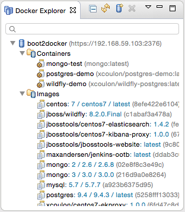
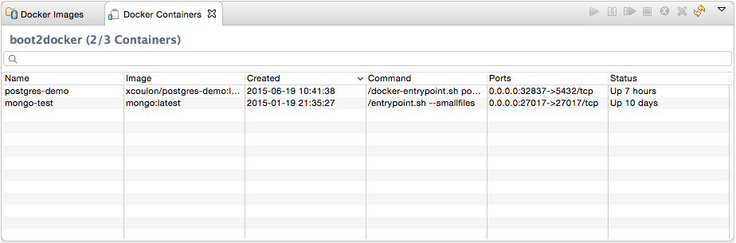
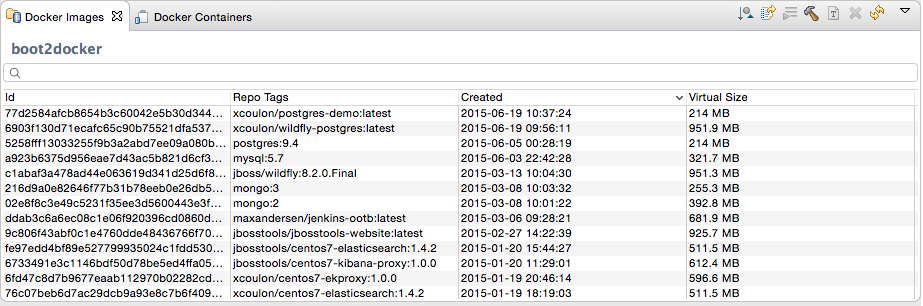
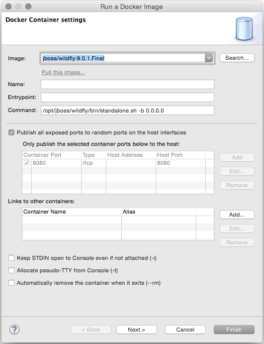
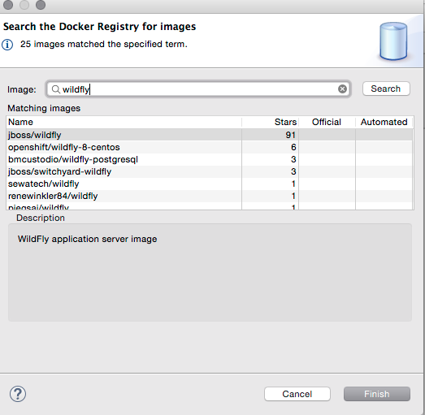
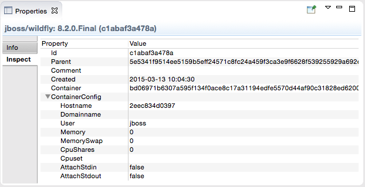
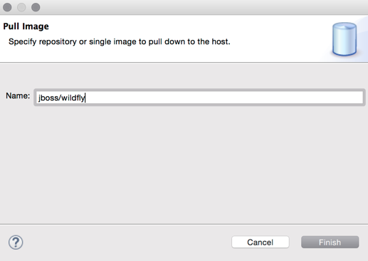

= Docker Tools What's New in 1.0.0.Final
:page-layout: whatsnew
:page-component_id: docker
:page-component_version: 1.0.0.Final
:page-product_id: jbt_core
:page-product_version: 4.3.0.Beta1

Tooling for Docker is available in Eclipse Mars under the http://eclipse.org/linuxtools[Linux tools]
umbrella. Despite this name, this works on all major developer platforms. It
is mirrored on http://tools.jboss.org/downloads/jbosstools/mars/4.3.0.Beta1.html[JBoss Tools update site]
and is also included in Developer Studio 9.0.0.Beta1.

== Connection Wizard

The connection wizard support both Unix sockets and REST API to connect to a
Docker engine

== Explorer View

The new "Docker Explorer" view displays containers and images in a tree view, with
filters to hide dangling and intermediate images and stopped containers.

== Containers View

The new "Containers" view displays the same information that appears when using the
`docker ps` or `docker ps -a` commands in a terminal.

== Images View

The new "Images" view displays the same information that appears when using the `docker images` command in a terminal.

== "Run Image" wizard

The new "Run Image" wizard lets users run an image by passing the most relevant arguments in the context of a developer machine:

- the name of the container (although this is optional)
- the exposed ports (the table is prepopulated with port numbers retrieved from the selected Image information)
- the links to containers
- the data volume
- the environment variables

The wizard also lets users search and pull images from the Docker Registry.

== Properties view

The `Properties` view responds to the selection on an Image or a Container in the aforementioned views to display general and detailed information.

== Other commands

The pull, push, display logs, commit, and tag commands are also available from contextual menus and view toolbars.

