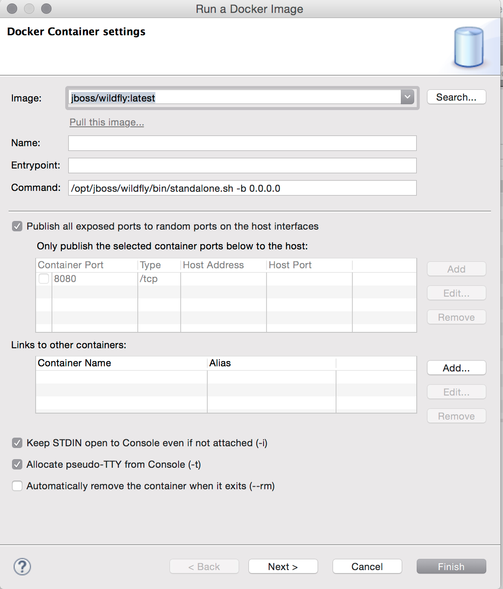
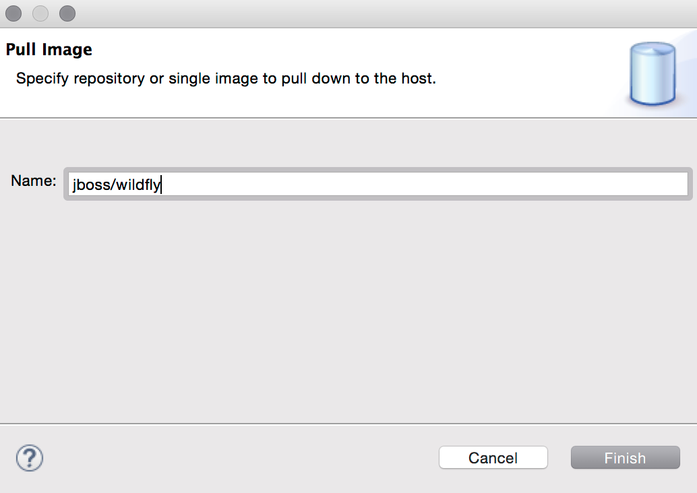

= Docker Tools What's New in 1.0.0.Final
:page-layout: whatsnew
:page-component_id: docker
:page-component_version: 1.0.0.Final
:page-product_id: jbt_core
:page-product_version: 4.3.0.Beta1

Tooling for Docker is available in Eclipse Mars under the http://eclipse.org/linuxtools[Linux tools]
umbrella but despite this name, it works on all major developer platforms. It
is mirrored on http://tools.jboss.org/downloads/jbosstools/mars/4.3.0.Beta1.html[JBoss Tools update site]
and included in Developer Studio 9.0.0.Beta1, too.

== Connection Wizard

The connection wizard support both Unix sockets and REST API to connect to a
Docker engine

image::./images/add_docker_connection.png[Open Connection Wizard]

== Explorer View

The new "Docker Explorer" view displays containers and images in a tree view, with
filters to hide dangling and intermediate images and stopped containers.

image::./images/docker_explorer_view.png[Docker Explorer View]

== Containers View

The new "Containers" view shows the same info as a user would get using the
`docker ps` or `docker ps -a` commands in his terminal.

== Images View

The new "Images" view shows the same info as a user would get using the `docker images` command  in his terminal.

image::./images/docker_images_view.png[Images View]

== "Run Image" wizard

The new "Run Image" wizard lets users run an Image by passing the arguments that we think are the most relevant in the context of a developer machine:

- the name of the container (although this is optional)
- the exposed ports (the table is prefilled with port numbers retrieved from the selected Image info)
- the links to containers
- the data volume
- the environment variables

The wizard also lets user search and pull an image from the Docker Registry

== Properties view

The Properties view responds to the selection on an Image or a Container in the aforementioned views to display general and detailled information

image::./images/properties_view.png[Properties View]

== Other commands

Pull, push, display logs, commit and tag commands are also available from contextual menus and view toolbars

