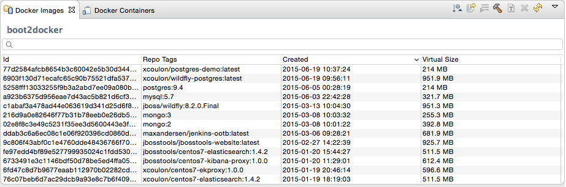
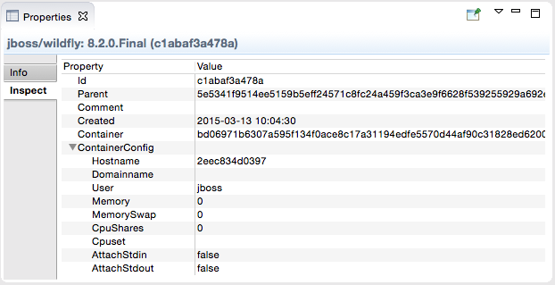

= Docker Tools What's New in 1.1.0.Final
:page-layout: whatsnew
:page-component_id: docker
:page-component_version: 1.1.0.Final
:page-product_id: jbt_core
:page-product_version: 4.3.0.Final
:page-include-previous: false

Tooling for Docker is available in Eclipse Mars under the http://eclipse.org/linuxtools[Linux tools]
umbrella. Despite this name, this works on all major developer platforms. It
is mirrored on https://tools.jboss.org/downloads/jbosstools/mars/4.3.0.Final.html[JBoss Tools update site]
and is also included in Developer Studio 9.0.0.Final.

== Connection Wizard

The connection wizard support both Unix sockets and REST API to connect to a
Docker engine. The wizard requires a unique name to identify the connection and
checks the required permissions on the Unix socket and on the path to the certificates
 for TCP connections.

image::./images/add_docker_connection.png[Open Connection Wizard]

== Explorer View

The new "Docker Explorer" view displays containers and images in a tree view, with
filters to hide dangling and intermediate images and stopped containers. The container
icons have decorators to indicate their state (`running`, `paused` or `stopped`).

image::images/docker_mars1/docker_explorer_view.png[Improved Docker Explorer View]

== Containers View

The new "Containers" view displays the same information that appears when using the
`docker ps` or `docker ps -a` commands in a terminal.

image::./images/docker_containers_view.png[Containers View]

== Images View

The new "Images" view displays the same information that appears when using the `docker images` command in a terminal.

== "Run Image" wizard

The new "Run Image" wizard lets users run an image by passing the most relevant arguments in the context of a developer machine:

- the name of the container (although this is optional)
- the exposed ports (the table is prepopulated with port numbers retrieved from the selected Image information)
- the links to containers
- the data volume
- the environment variables

image::./images/docker_run_image.png[Run Image Wizard]

== Dialog to Search and Pull Images

The `Pull Image` wizard can be launched from the `Docker Images` view
 or from the `Docker Explorer` view:

image::images/docker_mars1/docker_pull_image_wizard.png[Pull Image Wizard]

The wizard detects the tag in the image name and if none is specified, the image tagged `latest`
is pulled.

If the user needs to search a specific image name, she can click on the `Search...` button
which will open the `Search` wizard:

image::images/docker_mars1/docker_search_image_wizard1.png[Search Image Wizard]

This is followed by a second page that displays all the tags for the selected image:

image::images/docker_mars1/docker_search_image_wizard2.png[Search Image Tags Wizard]

Even though this wizard can only search from Docker Hub, users can still pull images
from other third-party registries. When doing this, the image name must contain a prefix with the
registry host and port, for example `192.168.59.103:5000/centos:7`.

== Launcher to Build a Docker Image

The Docker Tools also includes a launcher to build images from a Dockerfile.

image::images/docker_mars1/docker_image_build_launcher.png[Build Image Launcher]

The `source path` is a directory in the workspace or on the file system and the
`Docker Connection` combo box specifies on which Docker daemon the image will
be built.

== Properties view

The `Properties` view responds to the selection on an Image or a Container in the aforementioned views to display general and detailed information.

== Other commands

The push, display logs, commit, and tag commands are also available from contextual menus and view toolbars.
