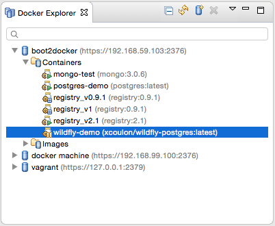
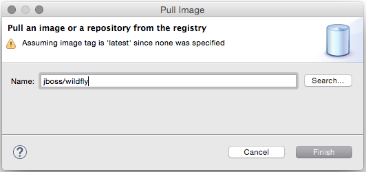
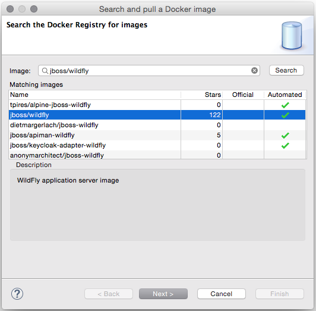
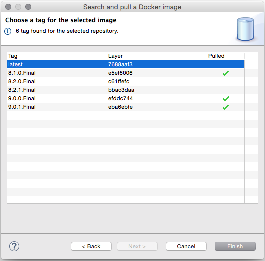
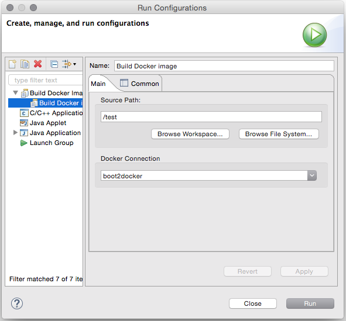

= Docker Tools What's New in 1.1.0.Final
:page-layout: whatsnew
:page-component_id: docker
:page-component_version: 1.1.0.Final
:page-product_id: jbt_core
:page-product_version: 4.3.0.CR1

== Improved Docker Explorer View

We have added icon decorators on the containers to show their state. This makes it
clearer whether a container is running, paused, or stopped.

== New Dialog to Search and Pull Images

We have worked on the workflow to pull and search images from Docker Hub.
 The updated `Pull Image` wizard can be launched from the `Docker Images` view
 or from the `Docker Explorer` view (a new context menu entry is available on the
connection node and on the `Images` node)

The wizard detects the tag in the image name and if none is specified, the image tagged `latest`
is pulled.

If the user needs to search a specific image name, she can click on the `Search...` button
which will open the `Search` wizard:

This is followed by a second page that displays all the tags for the selected image:

Even though this wizard can only search from Docker Hub, users can still pull images
from other third-party registries. Whend oing tihs, the image name must contain a prefix with the
registry host and port, for example `192.168.59.103:5000/centos:7`.

== New Launcher to Build a Docker Image

We have also added a new launcher to build images from a Dockerfile.

The `source path` is a directory in the workspace or on the file system and the
`Docker Connection` combo box specifies on which Docker daemon the image will
be built.

== Improved Connection Wizard

The interface for the connection wizard has not changed, but at the back end,
 it has been rewritten to better validate the input settings. The wizard now
 requires a unique name to identify the connection and checks the required
 permissions on the Unix socket and on the path to the certificates for TCP
 connections.
