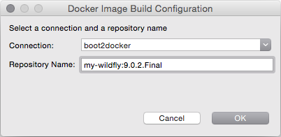
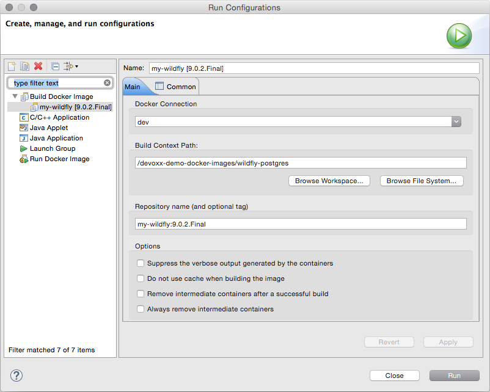

= Docker Tools What's New in 1.2.0.Final
:page-layout: whatsnew
:page-component_id: docker
:page-component_version: 1.2.0.Final
:page-product_id: jbt_core
:page-product_version: 4.3.1.Beta1

== Run Image Launch Configuration

When running an image, a launch configuration is created, based on the selected image.
This is useful when users want to try tweaking a previous run for various reasons
(e.g. binding in new volumes or changing command parameters, etc.)

Running a container from an image can now be also done via a launch configuration.

image::images/docker_mars2/run_image_launch_configuration.png[Run Image Launch Configuration]

== Docker Machine Support

Docker Machine is now supported for the creation of a new connection.
Simply click the "Search..." button and you will be prompted to select an active Docker Machine connection, if one exists.

image::images/docker_mars2/docker_machine_support.png[Docker Machine Support]

== TM Terminal Support for Interactive Shells

Containers created with a pseudo TTY allocated (-t) will open within a TM Terminal.
This is much more fully featured interaction when compared with the previous standard console.
In particular, the Terminal view recognizes the color code on logs and displays messages in appropriate colors.

image::images/docker_mars2/terminal_tm_support.png[]

== Build Docker Images improvements

A shortcut to build a Docker image from a Dockerfile is available.
On the first call, it will prompt for the Docker connection to use and an optional name (repo/tag) to give to the image.

The launch configuration also now supports most of the build options available from CLI.

