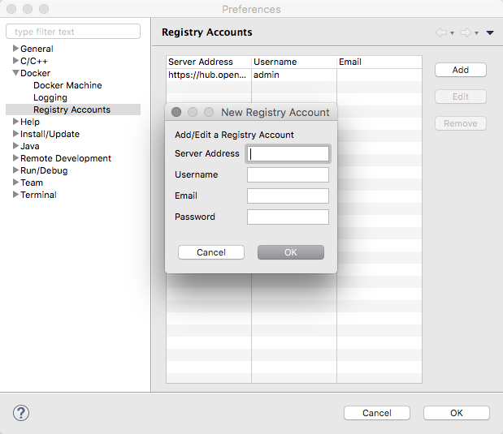
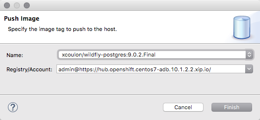
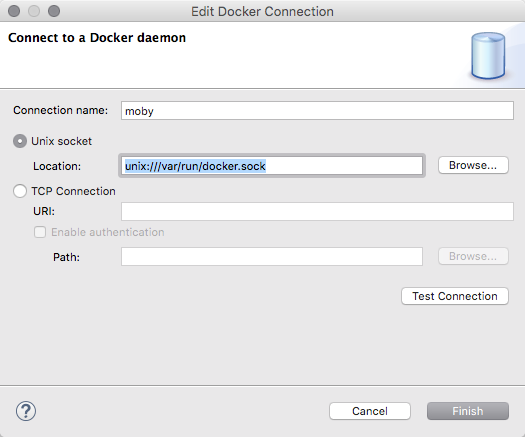

= Docker Tools What's New in 2.0.0.Final
:page-layout: whatsnew
:page-component_id: docker
:page-component_version: 2.0.0.Final
:page-product_id: jbt_core
:page-product_version: 4.4.0.Final

== Push images to registries with authentication

Docker images can be pushed to registries with support for authentication.
A preference page will let the user configure the Docker registries connection
settings, including the credentials to use.

The "Push Image" wizard lets the user select the target registry and then takes
care of tagging the image with the registry location before performing the push
operation.

== Edit configuration

Users can now edit the connection settings instead of having to remove and re-create
a connection when the settings changed (this can happen when the IP address allocated
  to a Docker Machine changed upon restart)

== Improved support for disconnections

We've kept working on the support for disconnections and the Docker Explorer view now
hides the expand button and changes the icon to a gray color  when the connection
to the Docker daemon is lost. Users can still edit the connection and use the 'Enable'
button in the toolbar to re-establish the connection when the target Docker daemon
is back in a running state.
