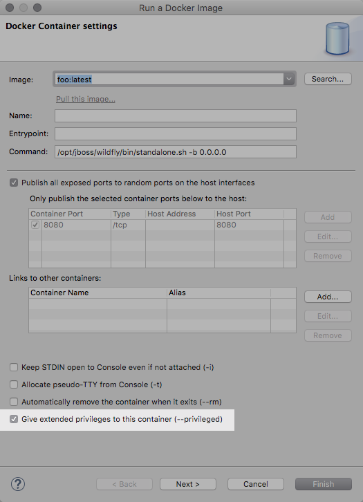

= Docker Tools What's New in 2.0.0.M7
:page-layout: whatsnew
:page-component_id: docker
:page-component_version: 2.0.0.M7
:page-product_id: jbt_core
:page-product_version: 4.4.0.Alpha2

== Dockerfile Editor

This is an awesome, external contribution, brought by Tobias Verbeke and his team from http://openanalytics.eu[Open Analytics].
The Dockerfile Editor provides users with content assist on the commands (ADD, COPY, RUN, etc.) as well
as a customizable syntax highlighting.

== Executing shell in a container

When running a container, users can execute shell commands from the `Terminal` view.

The context menu is available in the Docker Containers view and will be available
in the Docker Explorer view too in the next release.

== Running privileged containers

Containers can be run with the  `--privileged` flag,
which gives them extended privileges, such as accessing all devices, and allowing them nearly
all the same access to the host as regular processes running on the host (i.e., not in containers).

== Supporting disconnections

Sometimes the Docker instances that were configured in Eclipse are not running anymore
(the Docker Machine were stopped, for example).
In that case, the Docker Explorer view will display a different decorator for those connections,
and an "Enable connection" button in the toolbar will let the user reconnect.

