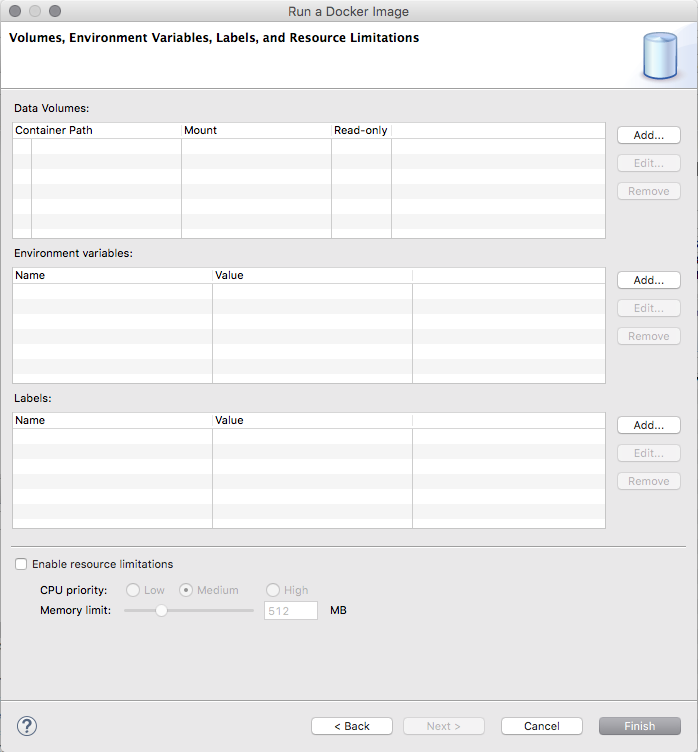
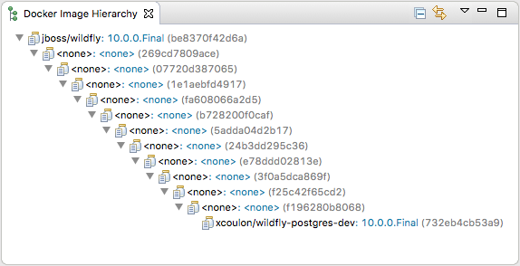

= Docker Tools What's New in 2.1.0
:page-layout: whatsnew
:page-component_id: docker
:page-component_version: 2.1.0
:page-product_id: jbt_core
:page-product_version: 4.4.1.AM3

== Support for Container Labels

Users can now specify labels when running a container.
The labels are saved in the launch configuration and can also be edited before relaunching the container.

See issues https://bugs.eclipse.org/bugs/show_bug.cgi?id=498166[498166],
https://bugs.eclipse.org/bugs/show_bug.cgi?id=497777[497777],
https://bugs.eclipse.org/bugs/show_bug.cgi?id=485913[485913] and
https://bugs.eclipse.org/bugs/show_bug.cgi?id=485936[485936]
in Eclipse Bugzilla for more details.

ifndef::finalnn[]
== Docker Hierarchy View

The new Docker Image Hierarchy view lets the user view the layers for
a selected image in the Docker Explorer View.
This is especially interesting when an image was built locally, as it helps understanding on which layers the top-level image depends.

See issue https://bugs.eclipse.org/bugs/show_bug.cgi?id=496308[496308] in Eclipse Bugzilla for more details.
endif::finalnn[]

== Automatically detect known Docker daemon connections

When the Docker Explorer view is opened, the list of existing connections (saved from a previous session) is reloaded.
In addition to this behaviour, the view will also attempt to find new connections using default settings such
the 'unix:///var/run/docker.sock' Unix socket or the 'DOCKER_HOST', 'DOCKER_CERT_PATH' and 'DOCKER_TLS_VERIFY' environment
variables. This means that by default, in a new workspace, if a Docker daemon is reachable using one of those methods, the
user does not have to use the "New Connection" wizard to get a connection.

See issue https://bugs.eclipse.org/bugs/show_bug.cgi?id=497101[497101] in Eclipse Bugzilla for more details.

== Extension point for Docker daemon connection settings

An extension point has been added to the Docker core plugin to allow for custom connection settings provisionning.

See issue https://bugs.eclipse.org/bugs/show_bug.cgi?id=497100[497100] in Eclipse Bugzilla for more details.
