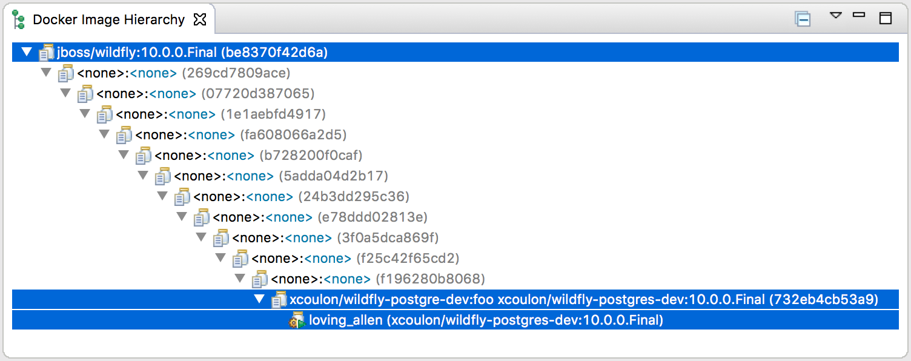

= Docker Tools What's New in 2.1.0
:page-layout: whatsnew
:page-component_id: docker
:page-component_version: 2.1.0
:page-product_id: jbt_core
:page-product_version: 4.4.1.Final

== Support for Docker Compose

Support for Docker Compose has finally landed !

Users can select a `docker-compose.yml` file and start Docker Compose from the
context menu, using the `Run > Docker Compose` launcher shortcut.

The Docker Compose process displays it logs (with support for text coloring based on ANSI escape codes)
and provides a `stop` button to stop the underlying process.

Also, as with the support for building and running containers, a launch configuration is created after the
first call to Docker Compose on the selected `docker-compose.yml` file.

See issue https://bugs.eclipse.org/bugs/show_bug.cgi?id=479592[479592]
in Eclipse Bugzilla for more details.

== Docker Image Hierarchy View Improvements

The new Docker Image Hierarchy view not only shows the relationships between
images (which is particularly interesting when an image is built using a Dockerfile),
but it also includes containers based on the images in the tree view
while providing with all relevant commands (in the context menu) for containers and images.

See issues https://bugs.eclipse.org/bugs/show_bug.cgi?id=499749[499749]
and https://bugs.eclipse.org/bugs/show_bug.cgi?id=499750[499750]
in Eclipse Bugzilla for more details.
